Exploring morph layouts in Cuis
===============================

This file is about how graphic entities, **Morphs**, may change as they are resized.

**NOTE: The examples here were done in Cuis 5; Cuis 6 is current and includes Vector Graphics and changes to the Morphic hierarchy.  Update of the graphics is in progress.**

A Morph which contains other Morphs may be resized and wish to maintain positional relationships between the contained Morphs.

We call this maintaining the submorph "layout".  We want to lay out each morph in a way that they are well related. 

Cuis has **LayoutMorphs** which do this for their submorphs.

Let's see how.

### Getting the layout edit panels

First we will load two tools to help us see how **LayoutMorphs** and **LayoutSpecs** are used and what they do.

Cuis remains small and comprehensible in part because we have **Features** which can be loaded as needed.  Each Feature is in a text package which notes its requirements.  To get the tools I want I open a Cuis image, Control-click to get the World Menu, Open a Workspace, and 

````Smalltalk
  Feature require: 'Layout-Edit-Panels'.
````

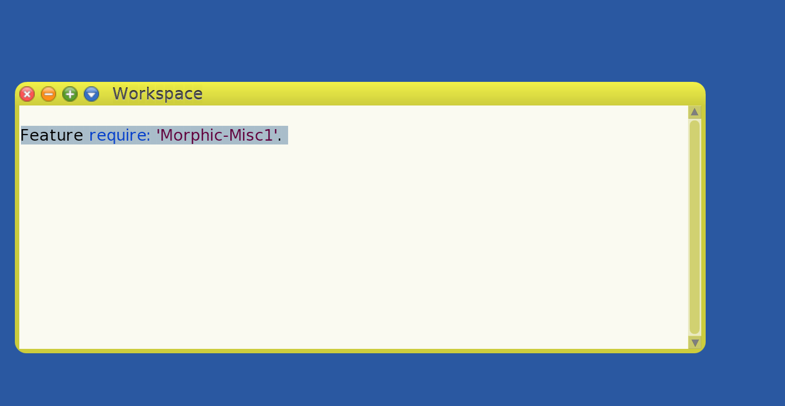

Of course, this won't work very well unless you actually have the packaged code for this Feature.

We assume you have Cuis set up as per
https://github.com/Cuis-Smalltalk/Cuis-Smalltalk-Dev#setting-up-cuis-in-your-machine

OK. I am running a Cuis image with a Workspace and have required Feature #'Layout-Edit-Panels.

Let's create a LayoutMorph to see what it does.

````Smalltalk
	myLayout _ LayoutMorph newRow.
````

Note how the **underscore character** gets represented in Cuis as a backward pointing arrow. This is a nice way to keep assignment completely separated from the equality concept. Alternatively, instead of `_` you can type `:=` as in Pascal. 

Note how the "syntax hilighting" in Cuis helps.  Class names are bold+black, message names are blue, symbols (#) are bold+blue.  "myLayout" is initially undefined (unrecognized) and shows up in red. This is temporary. 

I select the new text and type Cmd-d (DoIt) and see ... not much has changed, except "myLayout" is now blue.

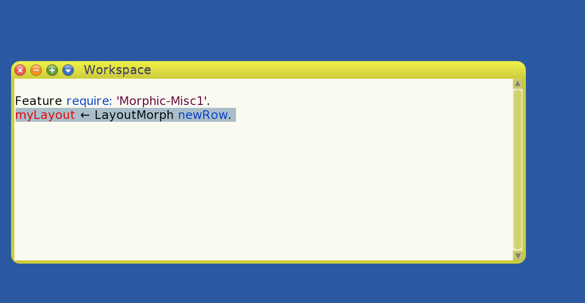

Ah!  Let me open it in the current Cuis World.  The Cuis backdrop is a PasteUpMorph which we call the World.

````Smalltalk
myLayout morphExtent: 400@300; color: Color lightBlue; openInWorld.
````

I took a shortcut here.  I sent three messages on one line.  The ';' (semicolon) character introduces a **cascade**.  What a cascade does is to send messages to the original recever object.

So the above is the same as typing:

````Smalltalk
  myLayout morphExtent: 400@300. 
  myLayout color: Color lightBlue.
  myLayout openInWorld.
````

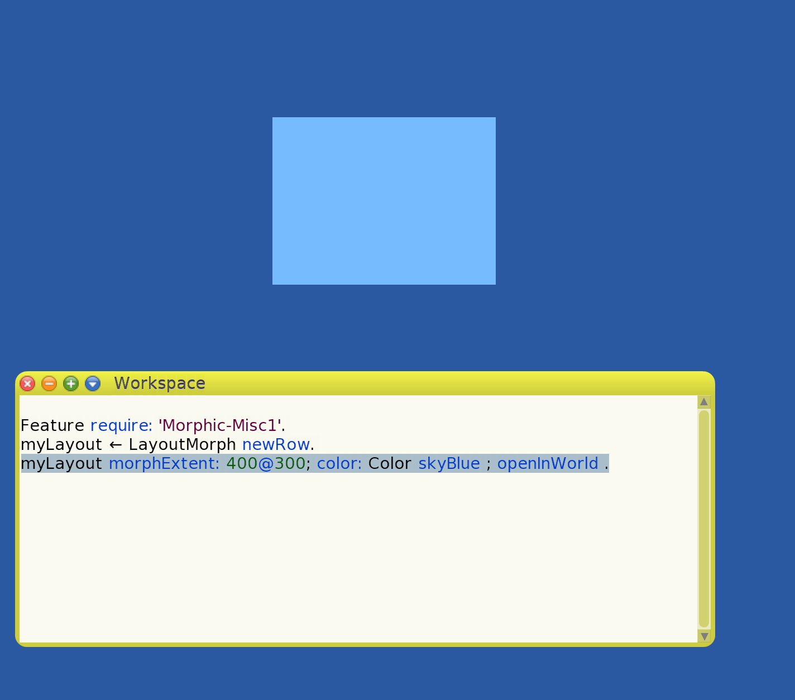


### Add submorphs

Well, a lightBlue rectangle is not much to work with.  Let's add a few submorphs -- morphs which are contained in the lightBlue LayoutMorph.

````Smalltalk
myLayout addMorph: (BoxedMorph new :: color: Color blue; yourself).
````


This introduces a different shortcut: "::".  The double-colon acts like ";" except that it uses the result of the previous message send as the target of the new message send. This shortcut is called a **chain**.

If we had typed

````Smalltalk
  BoxedMorph new ; color: Color blue;
````

the #color: message would have been sent to the **BoxedMorph** class, the target of the original message.

````Smalltalk
  BoxedMorph new :: color: Color blue
````

on the other hand sends #color: to the result of (BoxedMorph new), which is a new instance of a BoxedMorph.
  Using a cascade with #yourself allows us to get the target receiver, the BoxedMorph, which is then the argument to #addMorph: message sent to our LayoutMorph.

Whew!  OK.  No more shortcuts.  But these two shortcuts, cascade and chain, are very useful.

Back to layouts.

Let's add a simple **EllipseMorph** instance

````Smalltalk
  myLayout addMorph: EllipseMorph new.
````

Add a default ImageMorph, a cute little Cuis!

````Smalltalk
  myLayout addMorph: ImageMorph new.
````

Your Cuis World should look something like this.

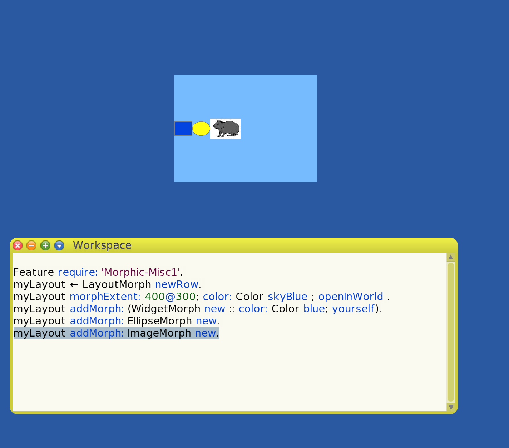

We have a blue rectangle, a yellow ellipse, and a cuis image in a row.

### LayoutMorph intro

Command-click (Windows button3, or click the mouse wheel) on the larger, lightBlue rectangle to get its **construction halo**. 


Click on the blue circle at top left to get a **context menu** for the LayoutMorph.


Select 'edit me (a LayoutMorph)'

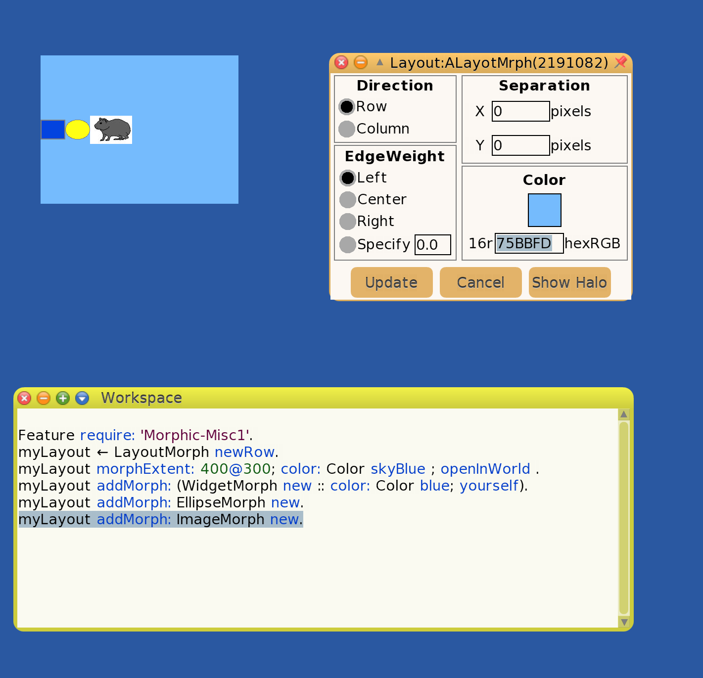


Let's move the LayoutEditor a bit to the right to see what is going on.  Also, click on the "push pin" in the label area at the end of the name of the Morph whose Layout we are editing.

If you don't click on the push-pin to keep the edit panel around, it will disappear when you click on either the Update or Cancel buttons.

This is great for "one shot" changes, but we will be trying a number of things and getting a new edit panel each time would be tiring.

In the EdgeWeight area of the layout edit panel, click on the Center circle.  This is a "radio button" selection.  Only one of the circles can be selected at any one time -- just like pushing the station select button on an old time radio.

Ok.  Now click the Update button below.

Congratulations!  You have just centered the submorphs in the layout row!

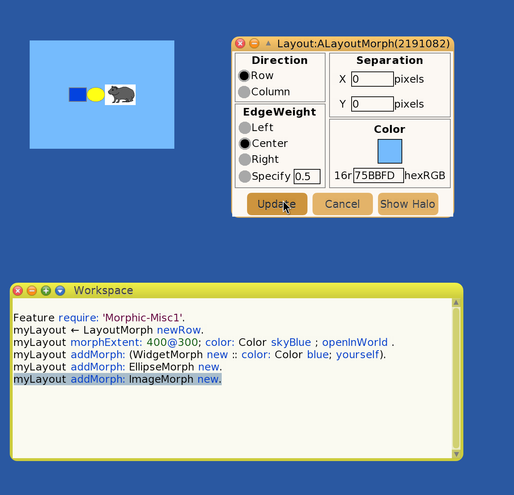


Let's change the LayoutMorph to be a column instead of a row.  Select Direction Column and click Update.

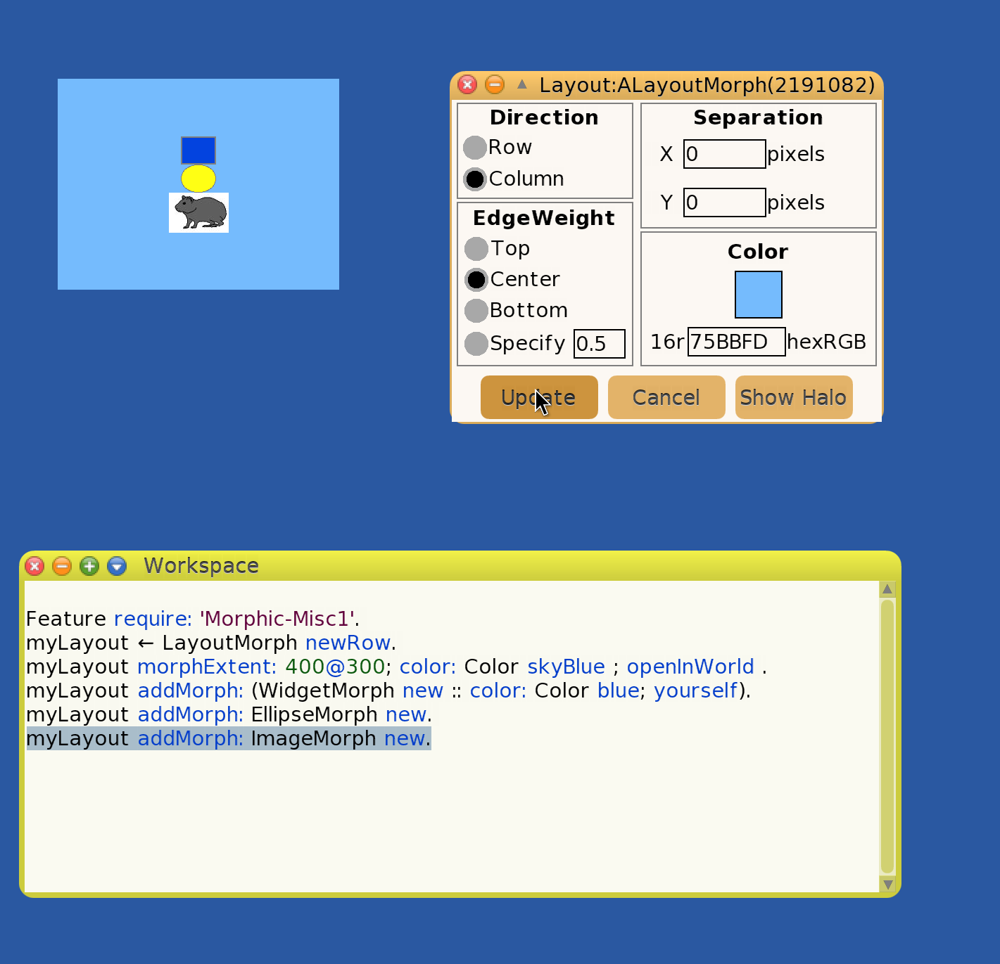


How about EdgeWeight Top and Update.


EdgeWeight Botton and Update.


If you put your mouse pointer over the box on the right of X or Y its content will highlight. Type a value and it will overwrite what is already there. Put '10' in each box.

The press Update.

You should now have a 10 pixel space between the submorphs.

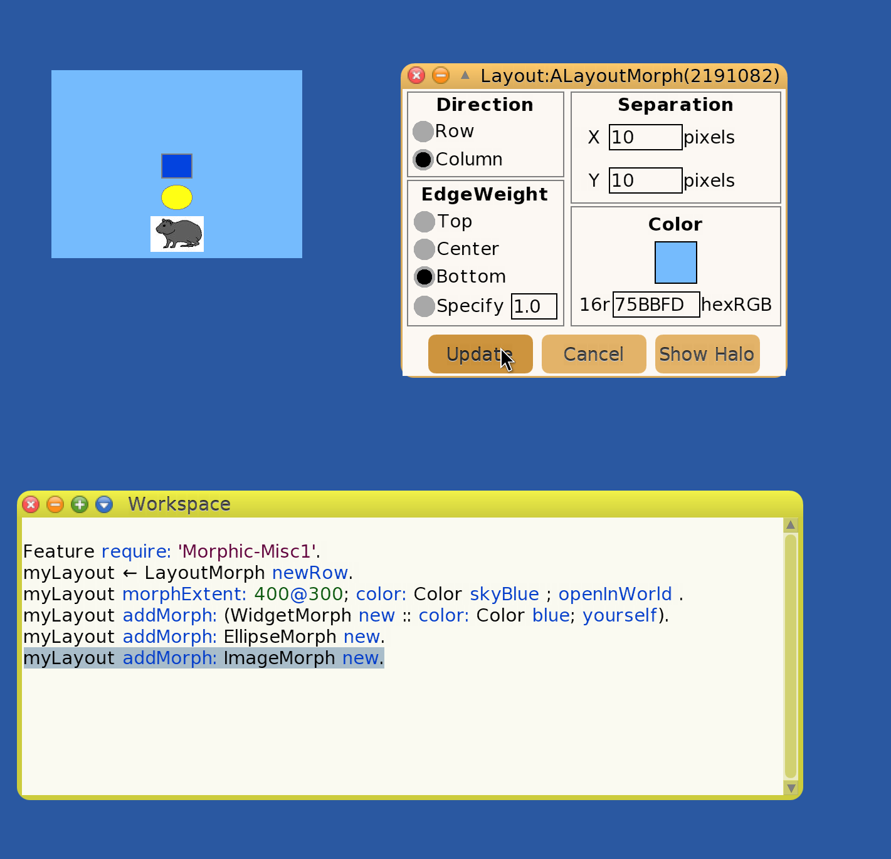

### LayoutSpec intro

So LayoutMorphs can layout submorphs in a row or a column, position submorphs along the line of the row or column, and set spacing between the Morphs.

What else can we do with layouts?

It turns out that each submorph can tell its containing LayoutMorph how it wants to be sized and placed within its layout.

Command-click (Windows shift-button3) on the yellow ellipse to get its halo, select the blue circle for its context menu, and select 'edit my layoutspec'.

Note that the original command-click halos the outer Morph.  Each additional click halos the next innermost Morph.  The Morph name is in a label at the bottom of the halo.

Move the LayoutSpec edit panel to one side and click on its push-pin.

You should have a World which looks something like the following

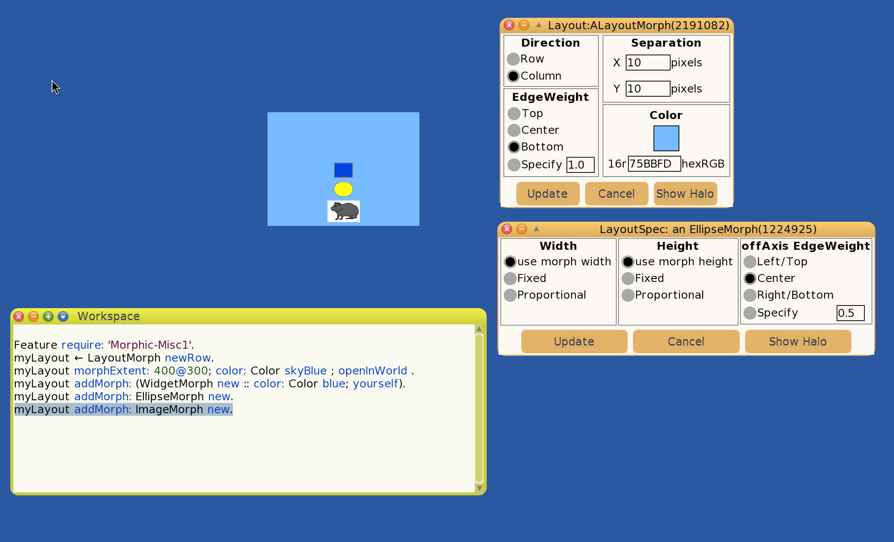

In the offAxis EdgeWeight section of the EllipseMorph's layout edit panel, click on 'Left/Top' and click on the Update button.

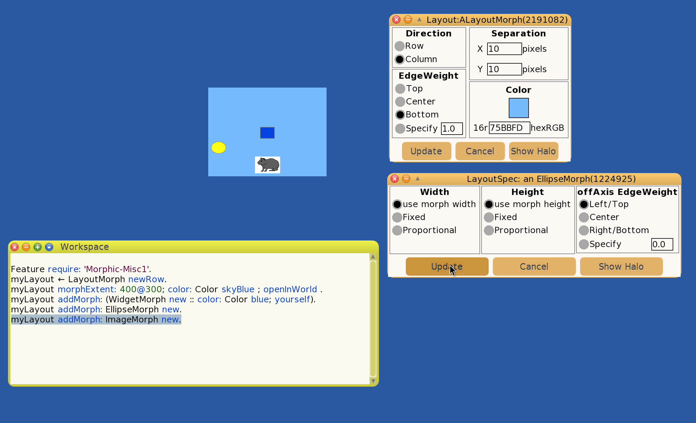

Aha!  The LayoutMorph places its submorphs in a Column along the center line, but a submorph can specify where it wants to be placed along the cross axis.

By the way, we are starting to get a number of edit panels up.  It can get confusing to remember the funny instance names for the morphs we are applying edit changes to.  If you click on the 'Show Halo' button, or if you click on the 'arrowUp' icon on the title bar, the construction halo for the Morph being edited will appear. 

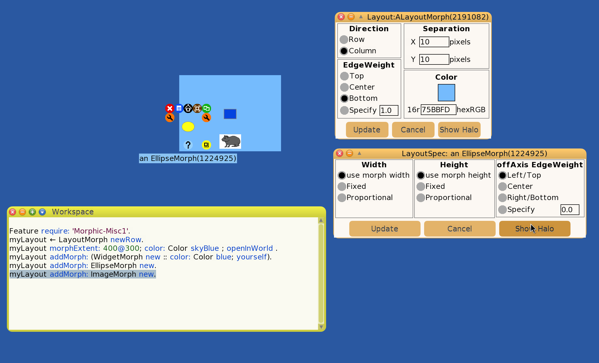

So it is always easy to find out who is being edited.

OK.  Let's change the column back into a row.  Click on Left and Row radio buttons in the layout edit panel and Update to see the other orientation. What do you think will happen?

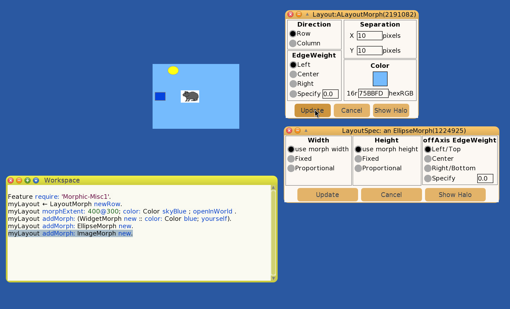

You guessed it. The ellipse is now on the top of the row instead of the left of the column.

What else can we do with LayoutSpecs?

Let's set the Width to a Fixed 80 pixels and the Height to 40% of the container, with a 10 pixel minimum and Update.

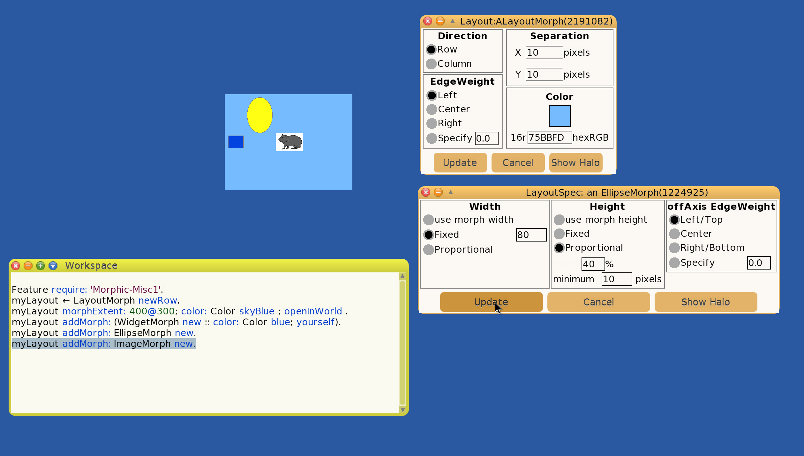

So when you resize the layout, the Ellipse keeps the same width, but its height is maintained at approxumately 40% of the LayoutMorph.

Command click on the blue rectangle, select 'edit my layoutspec' from its context menu, move the layoutspec edit panel aside and click on its push-pin.

Now set its Height to Proportional 50% with a minimum of 10 pixels.  Perhaps a Proportional Width of 80% and min 30 pixels.  Click Update.

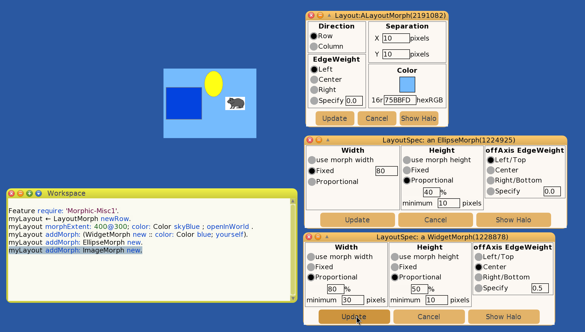

Lets resize the lightBlue LayoutMorph to see how things are kept in place.

If you 'show halo' from the layout edit panel or command-click on the lightBlue rectangle, you can drag the yellow _grab handle_ on the lower right corner of the LayoutMorph to change its size dynamically.

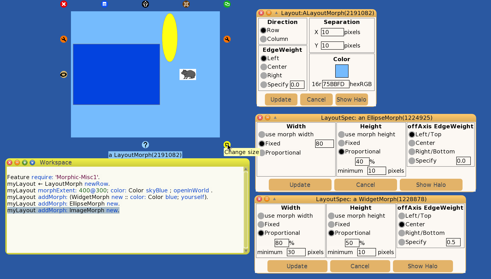

By now I expect that you know what the buttons do and can play all day with layouts.

You can use the layout and layoutSpec edit panels to test how you want your Morphs to resize within their containers.

LayoutMorphs can be nested and given their own LayoutSpecs.


In Part 2 on Layouts, we will look at the code for setting up layouts and exploring them.

- https://github.com/Cuis-Smalltalk/Learning-Cuis/blob/master/LayoutTourPart2.md
