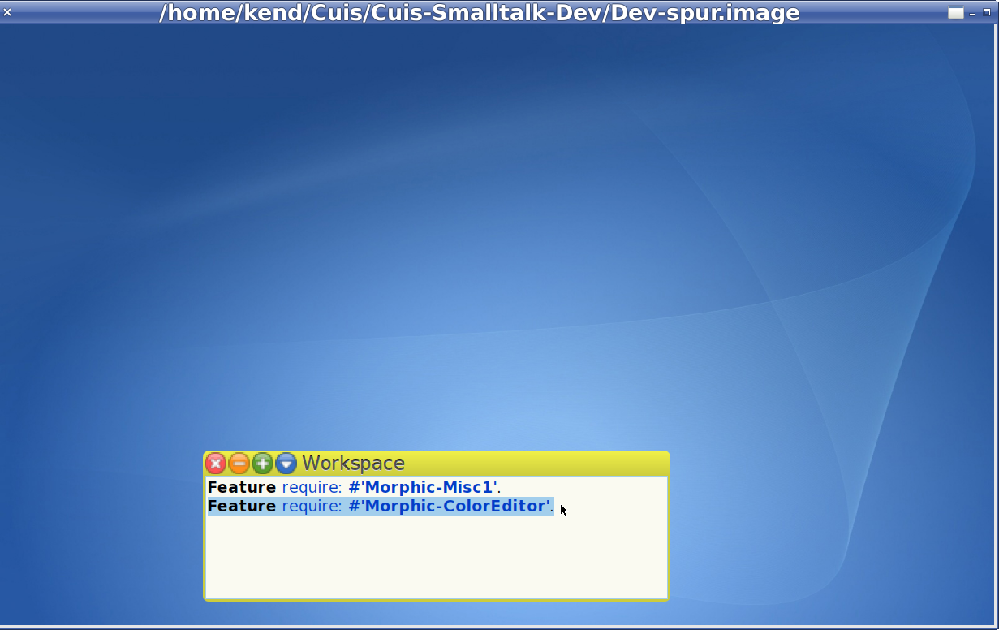
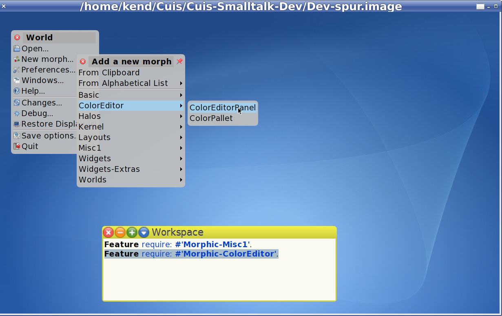
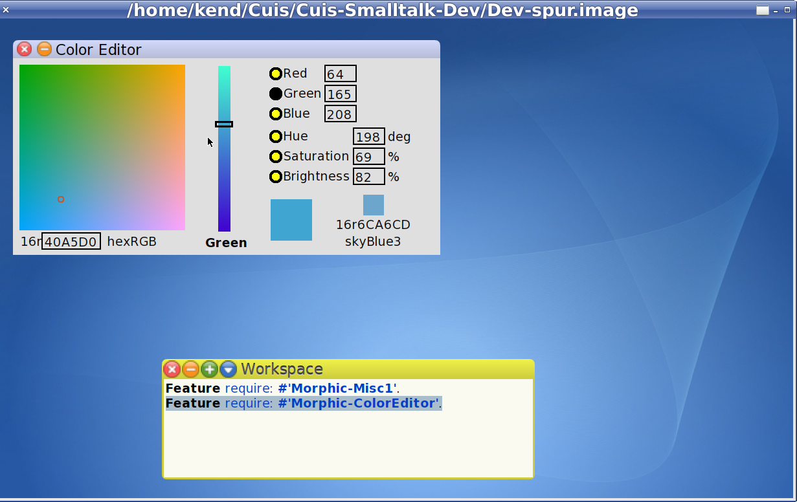
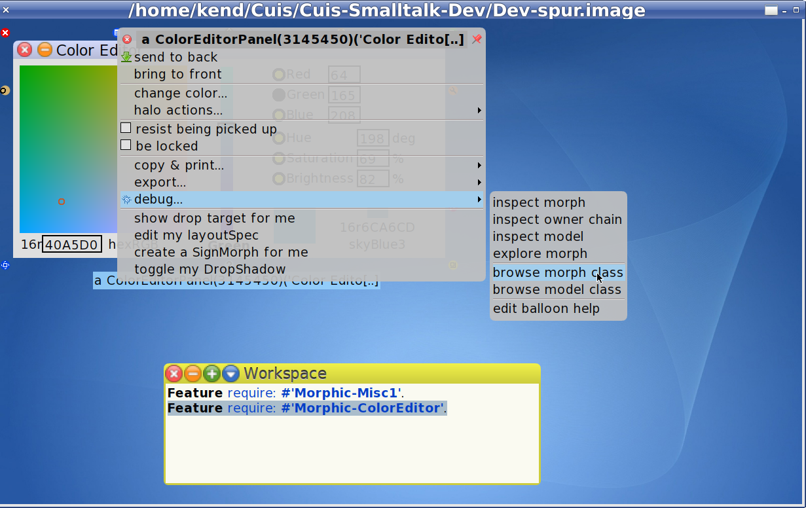
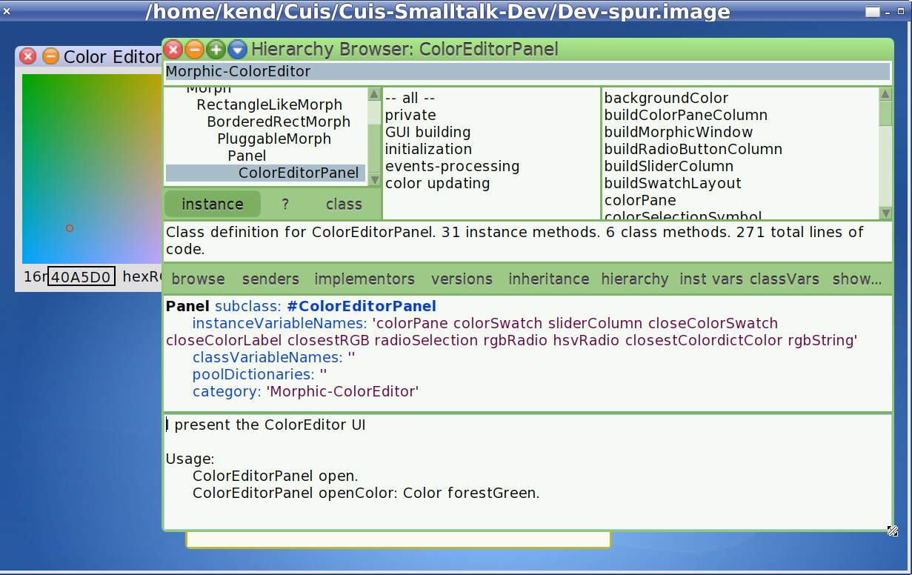
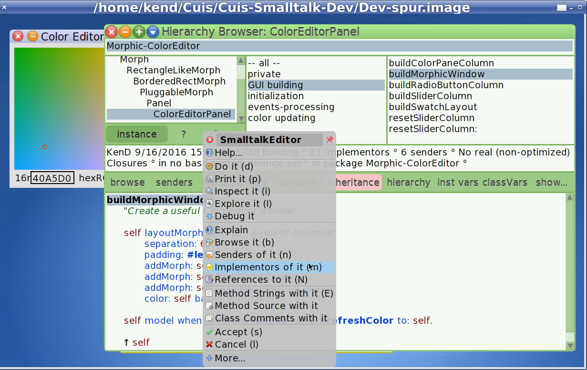
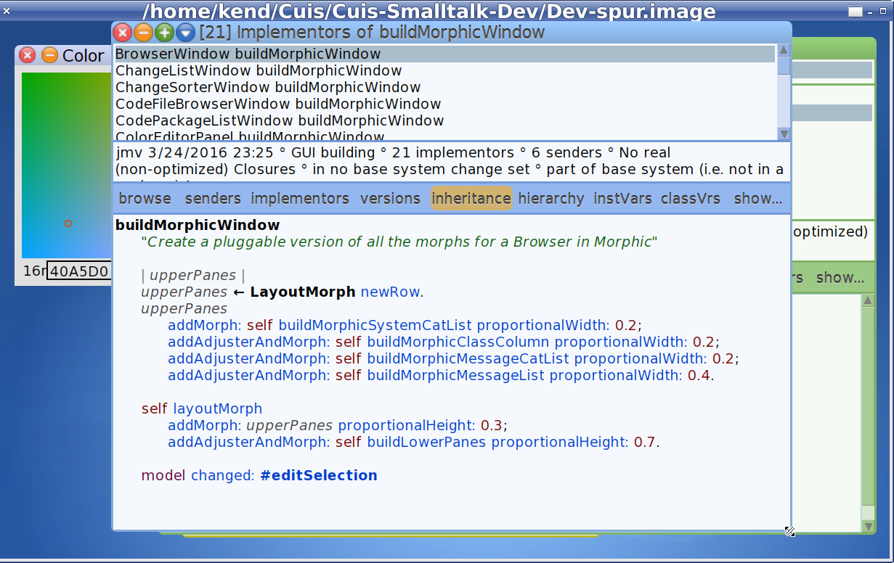
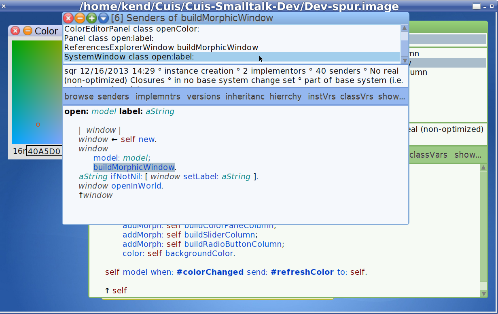

Exploring morph layouts in Cuis
===============================

In LayoutTour.md we saw how LayoutMorphs and LayoutSpecs can be used to maintain layout relationships between Morphs in graphic code.

Here we explore how to set up layouts in Smalltalk code.

If you have not done so already, please read part 1, which includes instructions to get required Features:
- https://github.com/Cuis-Smalltalk-Learning/Learning-Cuis/blob/master/LayoutTour.md

### Getting Started

We will start with layout of the Color Editor Panel.

First we need to load the code for the Color Editor. 

````Smalltalk
  Feature require: #'Morphic-ColorEditor'.
````



OK. Command-Click on the World background to get the World Menu and select the ColorEditorPanel from New Morph..->ColorEditor.



Thus we get a handy Color Editor.



### Color Editor Overview

First of all, what do we have here?

The goal of a good user interface is to provide visibility and control.  What is here?  What can I do with it?

Color is a very complex concept and specifying colors on computers has some interesting and deep complexities

- https://en.wikipedia.org/wiki/HSL_and_HSV

Fortunately, people have been working on this problem for some time.  One solution, used here, is to present a plane, or slice, through a color cube (e.g. R|G|B = Red|Green|Blue or H|S|B = Hue|Saturation|Brightness) and use a Slider to move the depth of the slice/plane.

Also here, one can click on the (2D) plane -- see the little circle? -- and have the other elements display their values at the X/Y/Z coordinates of the (X,Y) plane and (Z) slice.

In Addition to the RGB value, there is a display of the color "swatch" at that point, and the closest matching named color in a particular color dictionary (CSS3 web color names) along with the named color's RGB specification.

This gives us a lot of control to experiment with and specify color values.


### Layout Strategy

Looking at the ColorEditPanel and squinting a bit, one might see three columns.  The large block of color on the left, the slider, and a column on the right with radio buttons and the small color swatches.

Looking at the area of radio buttons, we see that each is a row which has a label, an edit box, and possibly some other annotation.

Lets look at the code to see how this is set up.

### Hierarchy Browser

One can use the world menu to open a code browser, but another way is to command-click on the Morph of interest, open its menu, and select debug...->browse morph class.



Here is a Hierarchy Browser expanded a bit.



The reason this is called a Hierarchy Browser is that it shows a class nested with it parent class, its grandpatent class, and so on.  

This lets one look at inheritance of methods, how each layer of class adds some capability or refinement to its parent, and what "send to super" does.  More on this later.


What we see under the 'GUI building' category is a method named #buildMorphicWindow.

Here we see the row of three columns.  Cascades (';') are used to send multiple messages to the same LayoutMorph target to add the column morphs and set some attributes like color and padding.  

From the code, one can assume from #addMorph: that each of the #build* methods return a Morph.  Easy enough to select the named methods ane check, but let's wait a minute on that.

Code browsers are really, really handy and we will be using them a lot, so it is useful to take the time to note some of the many ways they can help us out.



Here I have selected the name 'buildMorphicWindow' and command-clicked to get the menu for the SmalltalkEditor pane.

Each such help menu is specialized for the context in which it is used.  We call this 'context sensitive' menus.

Right now I want to point out that there is a convention on window building to use a method called #buildMorphicWindow.

Browsing 'Implementors of it' shows all the classes which implement this method.



Browsing 'Senders of it' shows how the method is used.



SystemWindow, by the way, is an important class.  Most browsers are specialized SystemWindows.

OK. Back to ColorEditPanel>>buildMorphicWindow.


@@@@

OK. Let's use an ObjectExplorer to investigate the structure of objects in the ColorEditPanel.

@@@@


Looking at the ObjectExplorer, I find that I can get easily lost in deep nests of Morphs. 

I like to take a step back and ask a question.

What tools do I need to help me be successful?

How do I make things visible?

Let's try some experiments..

@@@

The great think about Layouts is that they provide a good deal of control.  Once they are set up, however, they can be complex to interpret.

What do I mean by this?

@@@@@


@@@@@


