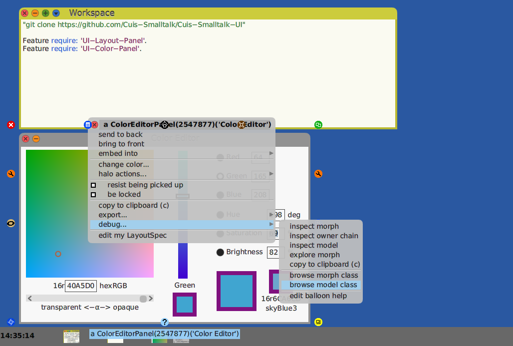

Exploring morph layouts in Cuis
===============================

In LayoutTour.md we saw how LayoutMorphs and LayoutSpecs can be used to maintain layout relationships between Morphs in graphic code.

Here we explore how to set up layouts in Smalltalk code.

Along the way, we will introduce some tools as well.

If you have not done so already, please read part 1, which includes instructions to get required Features:
- https://github.com/Cuis-Smalltalk/Learning-Cuis/blob/master/LayoutTour.md

### Getting Started

We will start with layout of the Color Editor Panel.

First we need to load the code for the Color Editor. 
````Smalltalk
  Feature require: 'UI-Color-Panel'.
````


OK. Command-Click on the World background to get the World Menu and select the ColorEditorPanel from New Morph..->User Interface->A-Fon->ColorEditorPanel.


Thus we get a handy Color Editor.


### Color Editor Overview

First of all, what do we have here?

The goal of a good user interface is to provide visibility (What is here?) and control (What can I do with it?).

Color is a very complex concept and specifying colors on computers has some interesting and deep complexities

- https://en.wikipedia.org/wiki/HSL_and_HSV

Fortunately, people have been working on the problem of color presentation and selection for some time.  One solution, used here, is to present a plane, or slice, through a color cube (e.g. R|G|B = Red|Green|Blue or H|S|B = Hue|Saturation|Brightness) and use a Slider to move the depth of the slice/plane.

One can click on the (2D) color plane -- see the little circle? -- and have the other elements display their values at the X/Y/Z coordinates of the (X,Y) plane and (Z) slice.

In Addition to the RGB value, there is a display of the color "swatch" at that point, and the closest matching named color in a particular color dictionary (CSS3 web color names) along with the named color's RGB specification.

There is also an _Alpha Value_ slider to show the selected color with varying transparency.

This gives us a lot of control to experiment with and specify color values.


### Layout Strategy

Looking at the ColorEditPanel and squinting a bit, one might see three columns.  The large block of color on the left, the slider, and a column on the right with radio buttons and the small color swatches.

Looking at the area of radio buttons, we see that each is a row which has a label, an edit box, and possibly some other annotation.

Lets look at the code to see how this is set up.

### Hierarchy Browser

One can use the world menu to open a code browser, but another way is to command-click on the Morph of interest, open its menu, and select debug...->browse morph class.

Let's do that with the Color Editor Panel.


Here is a Hierarchy Browser expanded a bit.


The reason this is called a Hierarchy Browser is that it shows a class nested within its parent class, its grandpatent class, and so on.  

This lets one look at inheritance of methods, how each layer of class adds some capability or refinement to its parent, and what "send to super" does.  More on this later.


What we see under the 'GUI building' category is a method named #buildMorphicWindow.

Here we see the row of three columns.  Cascades (';') are used to send multiple messages to the same LayoutMorph target to add the column morphs and set some attributes like color and padding.  

One can assume from #addMorph: messages in the code that each of the 'build' methods return a Morph.  Easy enough to select the named methods and check, but let's wait a minute on that.

Code browsers are really, really handy and we will be using them a lot, so it is useful to take the time to note some of the many ways they can help us out.


Here I have selected the name 'buildMorphicWindow' and command-clicked to get the menu for the SmalltalkEditor pane.

Each such help menu is specialized for the context in which it is used.  We call this 'context sensitive' menus.

Right now I want to point out that there is a convention on window building to use a method called #buildMorphicWindow.

Browsing 'Implementors of it' shows all the classes which implement this method.


Browsing 'Senders of it' shows how the method is used.


SystemWindow, by the way, is an important class.  Most browsers are specialized SystemWindows.

OK. Back to ColorEditPanel>>buildMorphicWindow.

Let's select the method 'buildColorPlaneColumn', which builds the column on the left.


I won't go into much detail here, but you can see that the first column has a #colorPane and a hexDisplayLayout which is the row of '16r[40A5D0] hexRGB' morphs.


As you scroll down, you will see LayoutSpecs used to set things up.  Finally, the column morph is created, the colorPane and hexDisplayLayout submorphs added, and the column morph is returned.

You can look through the other 'build' methods to see how the rest of the morphs are composed using Layouts and LayoutSpecs.


### The Model for the Editor

Back to the code browser.  I selected '-- all --' method category, moved the cursor to the method name list and typed the character $n.

When you type a letter in a browser selection list, the list scrolls to show the first name starting with that character.


The #newRadioSelection method is invoked when one clicks on a radio button.  

This method is a 'housekeeping' function.  It deselects the buttons which were not selected and causes the visible color  values and controls to be updated to correspond to the new state of the control.

When a user interface event is generated, a message is sent to the appropriate object so that it can react.  More on events, below.  In this case, the editor is reacting to a click on a radio button. 

One part of keeping the world ordered is to notify the editor's _model_ of changes.  Separating the bookkeeping for the editor or browser display and the editor or browser model  is a pattern you will see in a number of places.  

This separation of display and model allows one to have multiple views onto a consistent, shared model.

Let's close the browser on the ColorEditorPanel and open one on the ColorEditorModel.

Going back to the Color Editor, command-click, select its menu, and select debug..->browse model class.



You should now have a code browser on the ColorEditModel class.  This is a very simple model!  But it keeps the expected pattern of display/model separation.


### User Interface Events

I mentioned user interface events above.

There are two kinds of interactions common in computing.  One is the sequential "do this then do that" algorithmic code.

The other is "something happened -- deal with it".

User interactions fall into this second kind of computation.

One line in ColorEditPanel>>buildMorphicWindow registers 
````Smalltalk
self model when: #colorChanged send: #refreshColor to: self.
````

If you see this code in the Code Browser, you can select it and ask for implementors.


Another way to find messages is to type part of their name and search for usages.

From the World Menu, Open..->Message Names

Type in 'when:send' (without the ' quote-marks), press enter/cr, and you should see something like the next screen.


Any Smalltalk object can be the target of an event.  When an event occurs, it gets dispatched based on the event selector message name.

Using the edit menu to look up 'senders of' #colorChanged, we find:


In ColorEditPanel>>buildRadioButtonColumn we see
````Smalltalk
rgbRadio when: #informRadioSelection 
	 send: #newRadioSelection: 
	 to: self.
hsvRadio when: #informRadioSelection 
	 send: #newRadioSelection: 
	 to: self.
````

We already looked at ColorEditPanel>>newRadioSelection.

Attaching event handlers to objects, particularly models, allows multiple independent observers to get updates when things change without changing code in the model.  Multiple receivers (views) can get an update message for a single event.  

[User events such as mouse move, clicks, keyboard entry, and so on also turn into ordinary message sends.  This happens mostly via a HandMorph, but hardware event processing deserves it own tutorial]. 


### The Object Explorer

Let's use an ObjectExplorer to investigate the structure of objects in the ColorEditPanel.

The ObjectExplorer is another handy tool which shows the structure of an object -- its instance variables and their values.

In a Workspace, you can type 'anObject explore' for any Object.   For a visible Morph, we can command-click, and use the Morph's menu to select debug..->explore morph


The ObjectExplorer has a lower pane which acts as a mini-Workspace.  You can type code and Do-it (command-d).  

The upper pane acts like that in the FileList window.  Clicking on a triangle shows or hides the associated structure.


Before I dive too far into the ObjectExplorer, let me talk a bit about the difference between the Object Explorer and the Object Inspector.

We can get an Inspector on a Morph via its menu: debug->inspect morph.  Do-it on 'anObject inspect' in a Workspace also works.


An ObjectExplorer allows one to "drill down" through submorphs of submorphs.  An Inspector shows only a single object (one level).

In the mini-Workspace pane, the Object Explorer binds #self to the value of the selected (hilighted) object. An Inspector binds #self to the containing object being inspected no matter which instance variable is hilighted.

I selected the #privateDisplayBounds instance variable in each inspector asked 'self class' and clicked command-p (Print-It).  You can see the result.

Both tools are really useful, but right now I am interested in deep layout structure, so I will close the Inspecter and use the Object Explorer.

Clicking on the triangles of #submorphs at each level, I see that the ColorEditPanel has a title and a LayoutMorph and the LayoutMorph has our three column layouts.

An interesting thing to notice is that the order of submorphs is backward to their position when drawn.  The third layout morph is the one left.


Going down another couple of levels, I find the row of '16r[40A5D0] hexRGB.

So an ObjectExplorer is very handy tool to discover nested structure.

Looking at the ObjectExplorer, I find however, that I can get easily lost in deep nests of Morphs. 

At this point I like to take a step back and ask a question.

_What tools do I need to help me be successful?_

How do I make things visible?  How can I _see_ how these layouts are arranged?

Let's try some experiments.  I added code to Morph which you can look at.  More below.

One idea is to draw a frame around each LayoutMorph.  There happens to be a FrameMorph, so I used that.


Shrinking the ObjectExporerObject Inspector and moving it aside, I type in its mini-Workspace:
````Smalltalk
self showLayouts.
````


I get frames around layout for five seconds, and then they disappear.

Very interesting.

How about boxes around the non-layout Morphs which are being placed?
````Smalltalk
self showNonLayouts.
````


Hmmm..  Not much difference.

Still not quite what I want.

How about tinging row layouts red and column layouts blue?
````Smalltalk
self colorizeLayouts.
````


Now this I like!

Let me command-click and use the yellow circle to drag the lower right corner around to resize.


Wow.  This looks helpful to me.  I _see_ the layouts as they are resized.

Now I have a number of ways to adjust visual relations between morphs.  I can use code browsers.  I can use the Object Explorer.  I can use a LayoutMorphEditPanel or LayoutSpecEditPanel.  I can #colorizeLayout's and resize containing morphs.

Well, this is getting long.  I had better quit now.  

I hope this was helpful.

Look at the code.  Have some fun with it!
