# Quick-UI-Tour

Greetings and Welcome!!

This file is a quick tour of the Cuis User Interface (UI).

Smalltalk defined Object Oriented.  All computation is done by objects sending messages to themselves and each other.

Cuis shares with other Smalltalk implementations the characteristic that all objects are live.  All objects can be inspected and changed while they are executing.

There are many great tools waiting to be used.  This tour gives an introduction to a few  of the most important ones. 

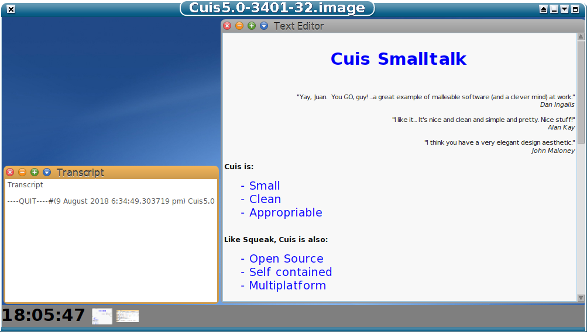

Perhaps the best way to think of Cuis is as a playground.

You can open a Cuis image using a portable virtual machine and see the same windows in the same positions pixel-per-pixel on Linux, Macintosh, Windows or any operating system where the VM runs.

You can start an image, do things with it and throw it away or save the image and its  record of the changes to be opened another time and take up right where you left off.

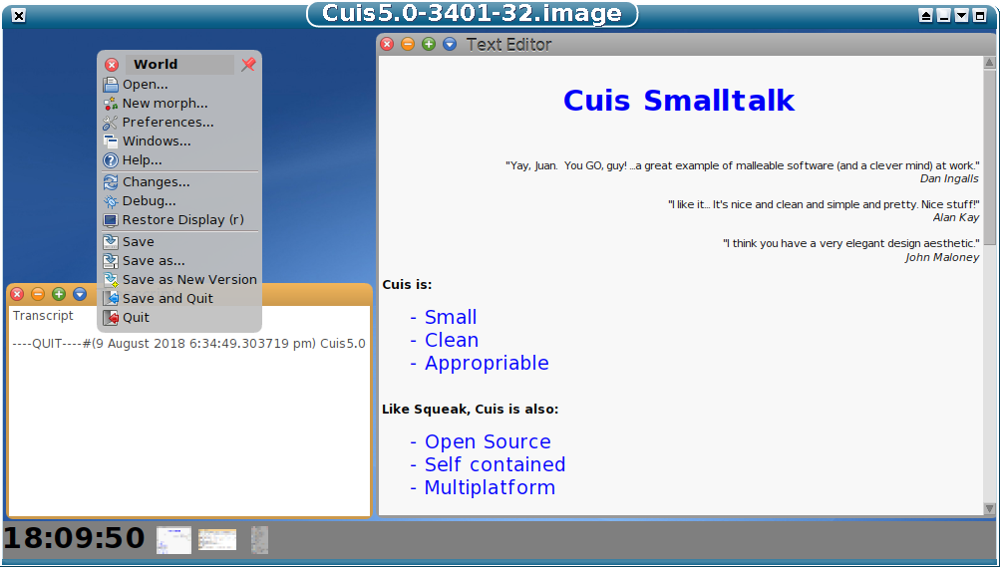

If you cmd-click on the desktop, you will see a World Menu.  

The command button "cmd-" may be a control ("ctrl") key [Linux], an apple key [MacOS], or some other command key based on your keyboard and operating system.

A three button mouse has
-  button 1 = left mouse button = select
-  button 2 = right mouse button = menu
-  button 3 = center mouse buttom = halo

If your mouse or touchpad has less than buttons, then you can use 
ctrl-click for button 3 and ctrl-shif-click for button 2.

A World Menu can be used for one-shot selections.  Just click on your selection, the action takes place and the menu disappears.  If you want to keep the menu up to make several selections, click on the push-pin icon in the upper right-hand corner.  The icon will disappear and the menu will stay up until you dismiss it by clicking on the circle-x close button in the upper left-hand corner.

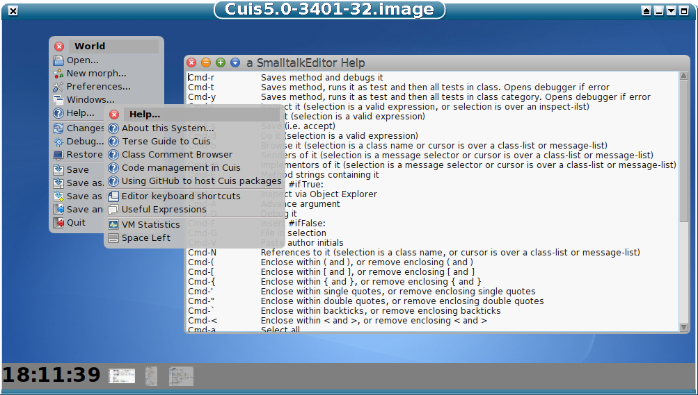

Of particular interest is the Help submenu.

Editor Keyboard Shortcuts gives helpful command-key usages.

The Help menu gives access to a lot of good information.

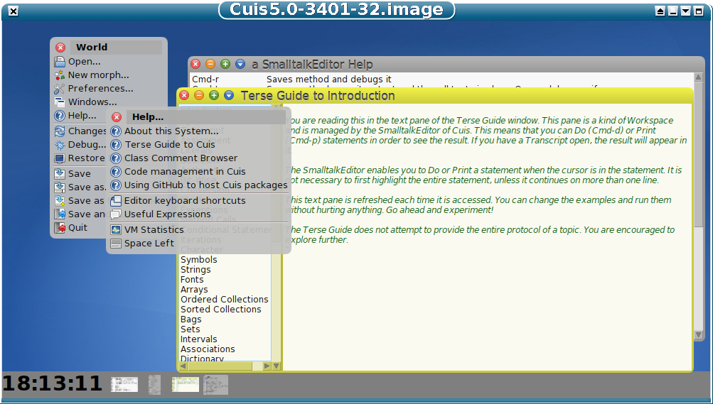

Also available from the Help Menu is the Terse Guide to Cuis.

The Terse Guide has many topics and shows code usages.  

You can select or change code in the Terse Guide pages and "DoIt" (cmd-d) or "PrintIt" (cmd-p) to see results.  Every time you re-visit a topic, the page is created again, so feel free to play.

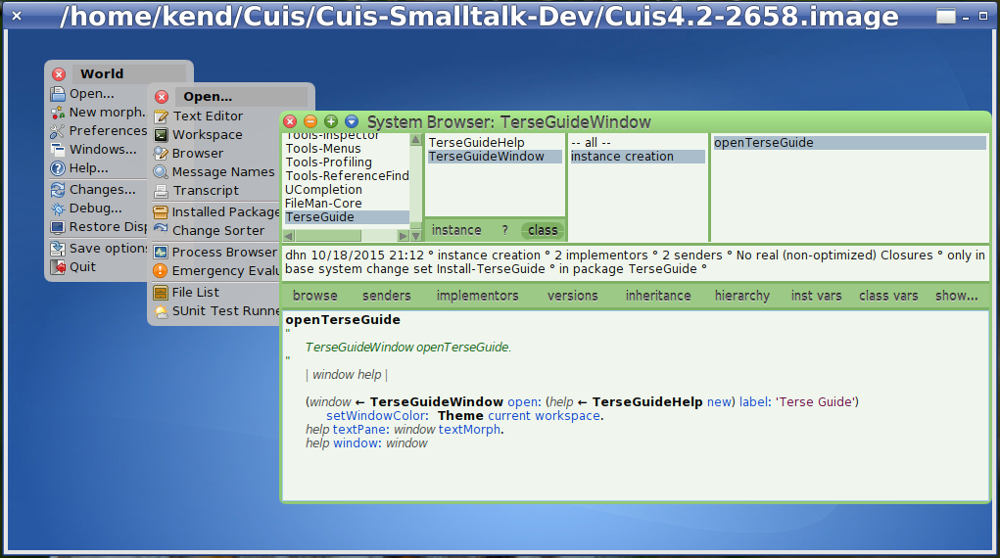

Clicking on World Menu -> Open.. -> Browser  brings up a System Browser, from which you can view all the code in the Cuis environment.

The panes are arranged by Category (upper left), Class, Topic, and Method (the code shown in the lower pane).

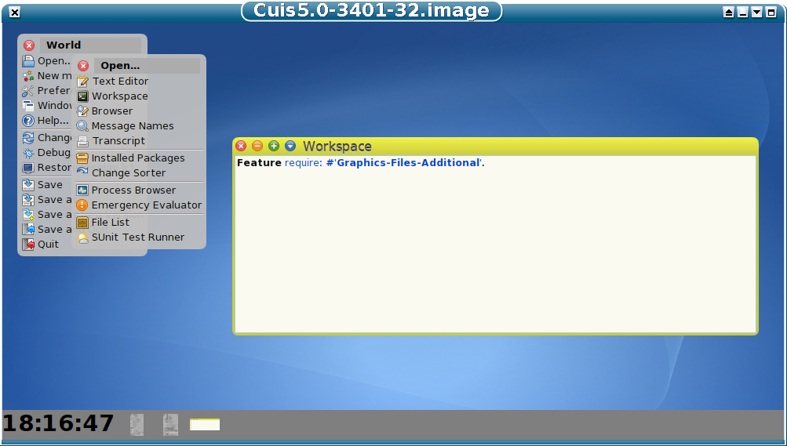

Clicking World Menu -> Open.. -> Workspace  brings up a Workspace window for you to type and run code.

As you type, the system does "syntax hilighting" which gives clues to class and method names.  If you start typing a method name, you can hit the Tab key which will usually give you a "select list" of possible message name completions.

Again, you can select code and DoIt (cmd-d) or PrintIt (cmd-p) to get results.

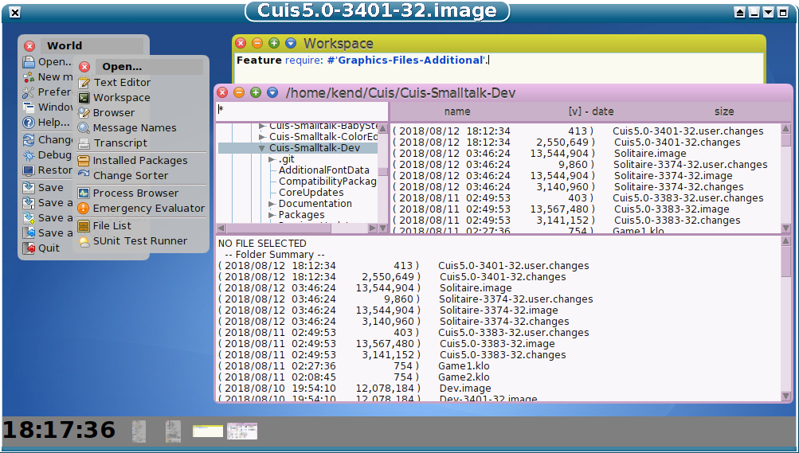

When you click on World Menu -> Open.. -> File List you get a multi-pane file browser.

The upper left pane shows a tree-view of the file system.  You click on the small triangles to show/hide subtrees.

Scroll down and click on the Packages triangle.

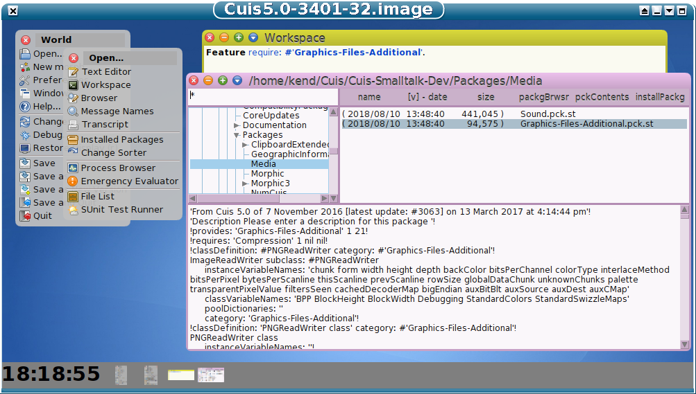

Clicking on a Directory shows File names in the right hand pane.  Clicking on a File entry shows its contents in the lower pane.

Here I clicked on the "Media" directory and the "Graphics-Files-Additional.pck.st" package file. 

The File List is context sensitive.  Viewing a text file or an image file or a file with Smalltalk Package code gives you different option buttons.

You can also "right-click" or "double-click" to get a context sensitive menu in many browser panes.  This works in most browsers.

In the picture above, a Package File has been selected.  Cuis Packages implement system Features.  The file shown implements a Feature named 'Graphics-Files-Additional' and requires the Feature 'Compression" be present.

Clicking on the "installPackage" button has the same effect as running the code in the previous Workspace picture.
````Smalltalk
  Feature require: #'Graphics-Files-Additional'.
````

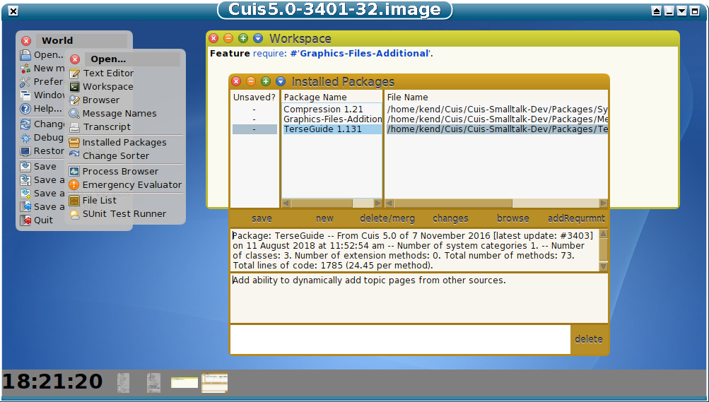

One way of keeping Cuis small and understandable is to use a small core of code and load Package Files to add Features.  Note the Terse Guide topic 'Features'.

World Menu -> Open.. -> Installed Packages shows the packages loaded into your Cuis environment.

You can create your own packages and add/remove requirements so that any packages your package requires will be loaded when you need them.   Note the Terse Guide topic 'Features'.

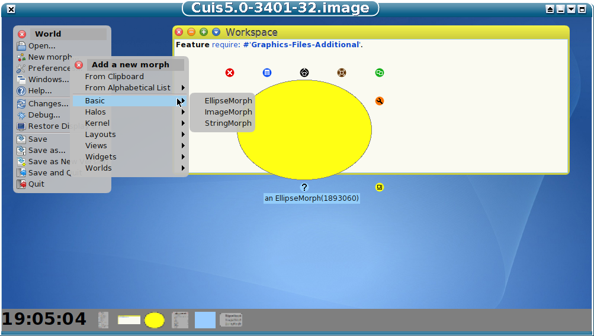

Smalltalks which descend from Squeak, like Cuis, have a system in which all graphic entities are objects called Morphs.

You can get morphs directly via World Menu -> New Morph...

This brings up a Morph Menu.

In this case, I selected a Basic Morph called an EllipseMorph.

I then cmd-clicked on the EllipseMorph to bring up a "halo" of "construction handles" (small circles around the Morph) and used the one in the lower right (Change Size) to make it bigger.

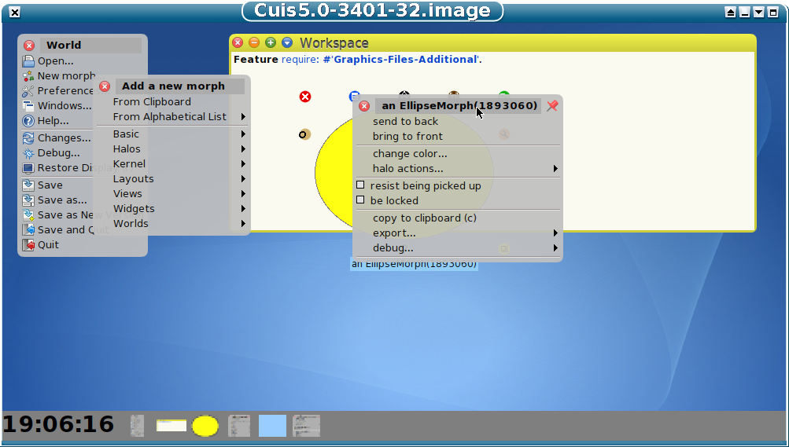

Clicking on the blue Menu button gives a menu for the morph.

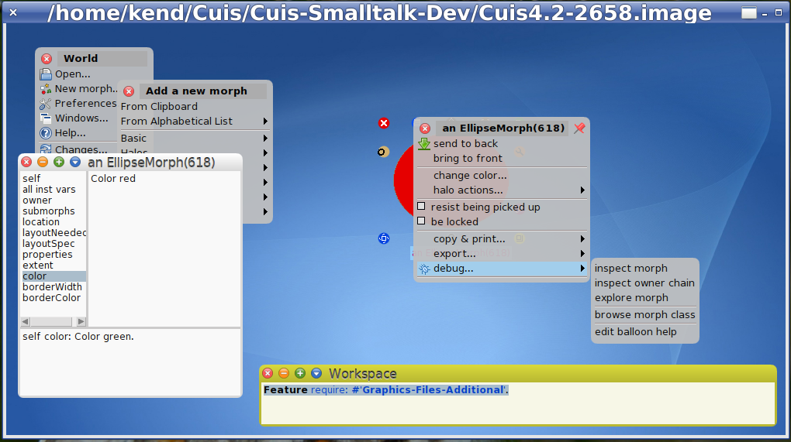

Selecting debug -> inspect morph gives an Object Inspector tool which allows one to see the inner structure of the morph, its "state".

One can click on a Morph's "instance variables" to see their values, and in turn "inspect" those values.

You can also write code in the lower pane in which "self" is bound to the object clicked on in the upper left pane.  So one can do things like changing the setting of the "color" instance variable.

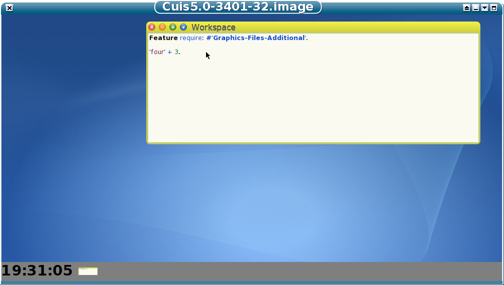

We learn by making mistakes and correcting them.

If you can make mistakes faster, you can learn faster!  

We like to make mistakes cheap and easy to fix.

Here I did a silly thing.  I typed the code to add the number 3 to a text string and pressed cmd-d (DoIt).  And guess what?  Things broke!

When this happens I get a textual view of the "code stack" showing what the system was doing when things broke.

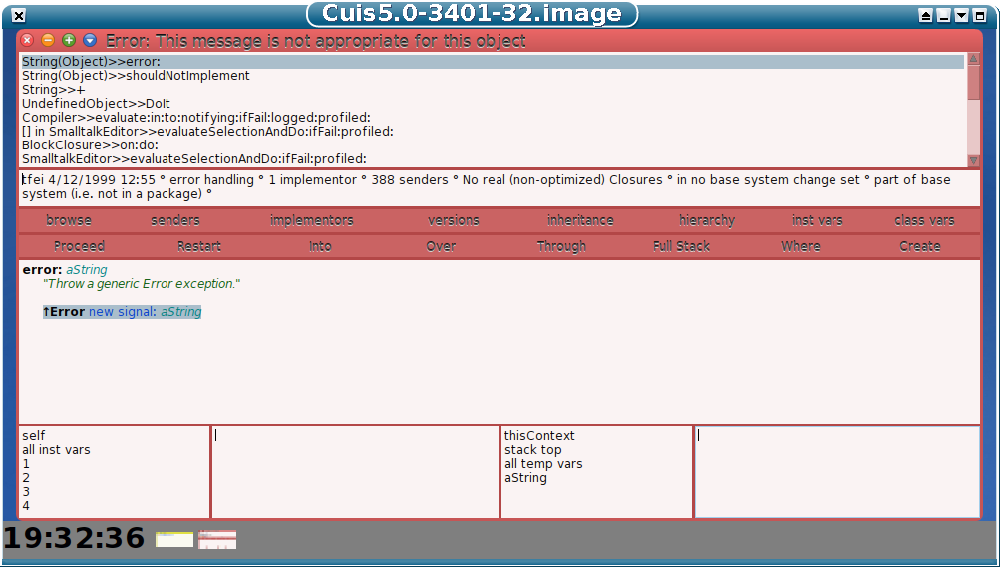

I can move down the stack by selecting a frame just below the active one.  Clicking on the lower left pane shows the value for self, the String object which gets the message.

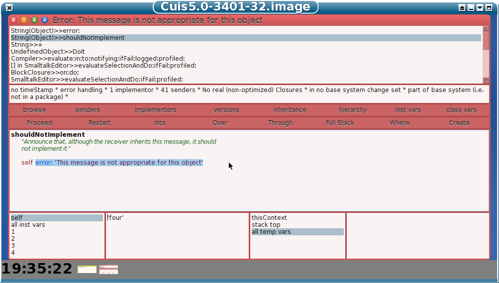

Clicking on the next frame down (the "+" frame) shows what the fuss is about and I see the method code for "+" in the String class.

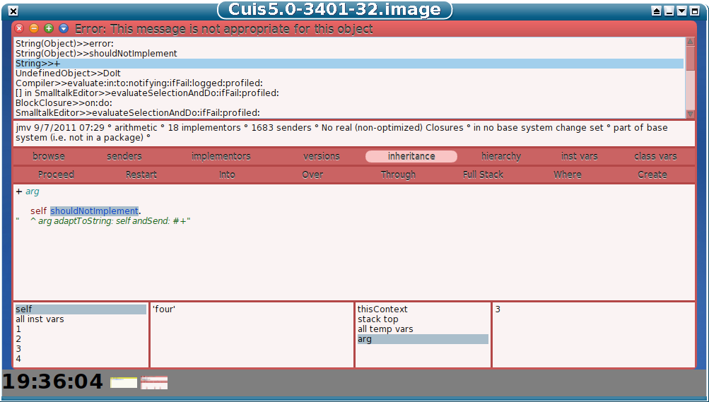

At this point I am just going to close the debugger and ignore this as adding a string and a number really is a silly thing to do.  But I could have written or changed some code and them re-executed the stack frame to continue the computation -- without unwinding the stack! 

Well, this is enough for thie brief introduction to the Cuis User Interface.

We hope you found the tour useful and have fun with Cuis!

