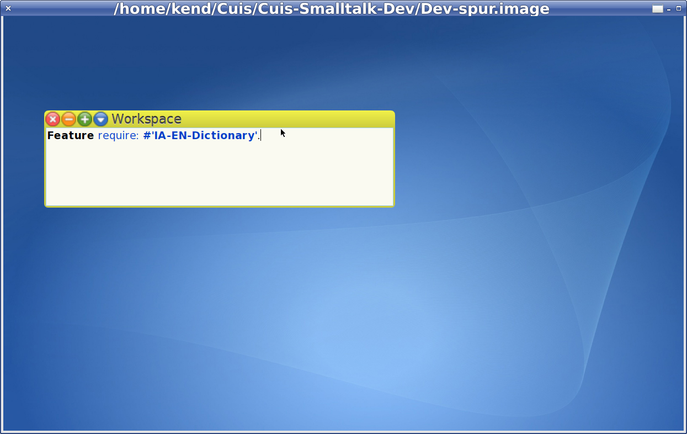
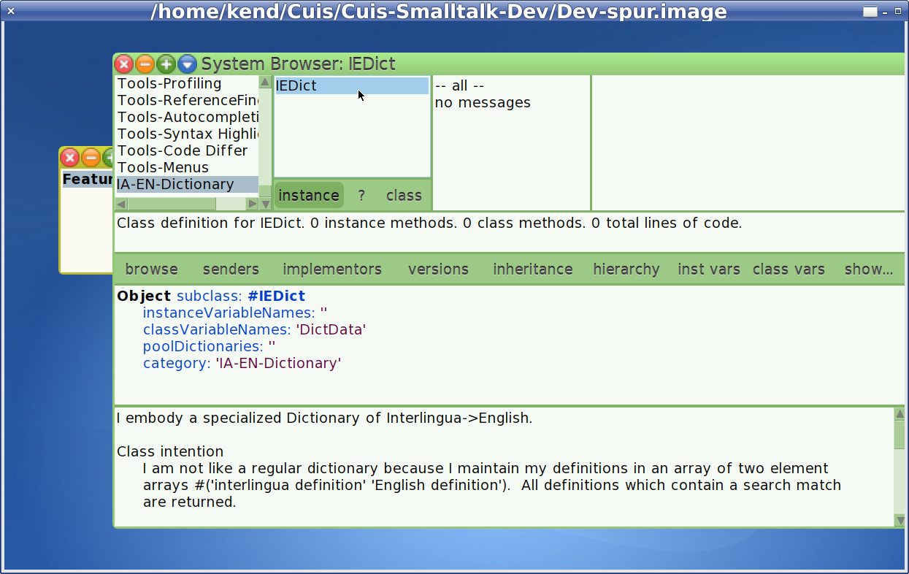
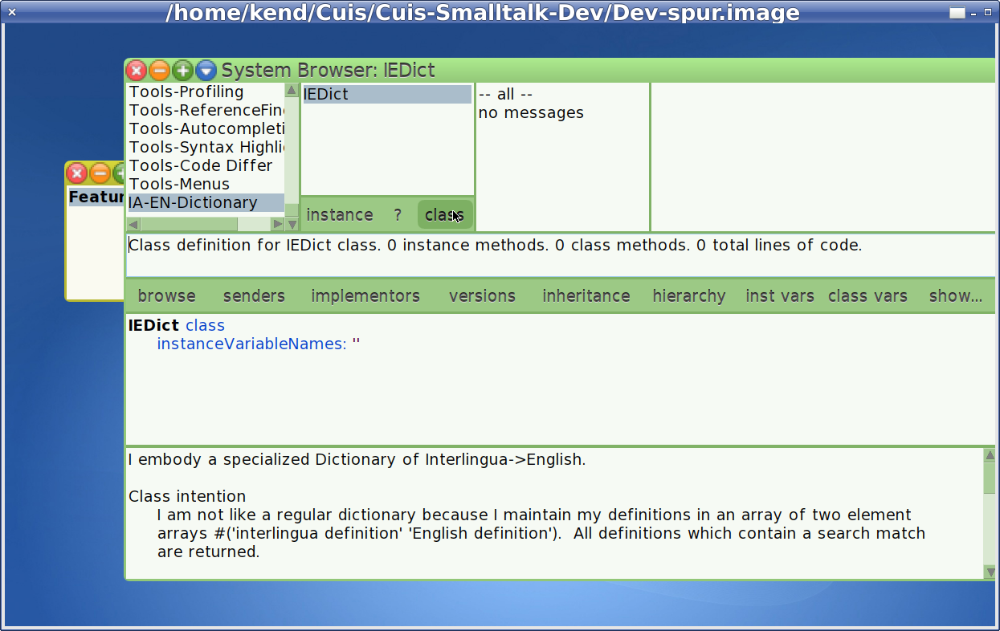
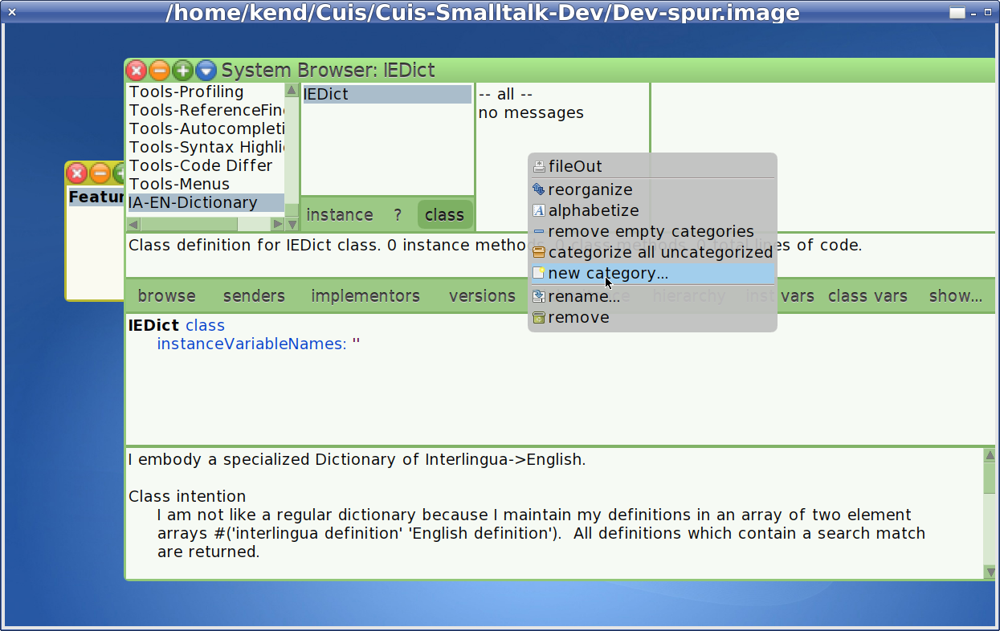
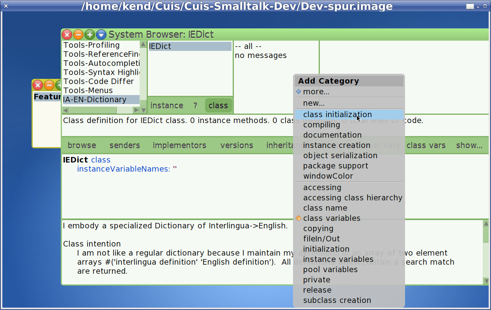
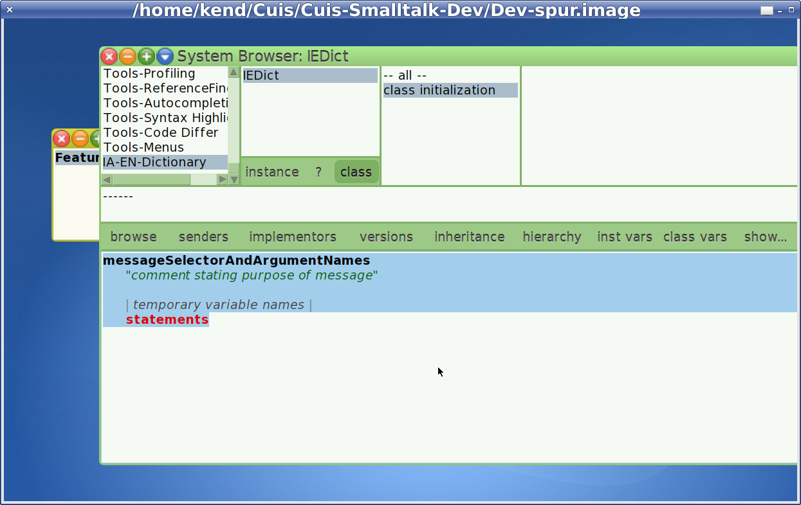

Making a Simple Package for Cuis -- Part 2
================================

This is a continuation of
- https://github.com/Cuis-Smalltalk-Learning/Learning-Cuis/blob/master/SamplePackage1.md

### Feature require: #'IA-EN-Dictionary'

We start with a "fresh" Cuis development image.

World menu -> Open -> Workspace

````Smalltalk
Feature require: #'IA-EN-Dictionary'
````

Note that Cuis does _syntax hilighting_ as you type.  Very useful, this.

- _Feature_ is the name of a class
- _require:_ is a message selector on the Feature class
- _#'IA-EN-Dictionary'_ is a _symbol_

You also have _word completion_.  If you start typing a word, e.g. 'Fea', then type TAB, you get a context based temporary select list of possible completions.

You can ignore these or select one of them and press enter/CR to complete the word you want.



In a Workspace you can select a line of code and either Cmd-click for the context menu and select DoIt or press Cmd-d to compile and run the code.

If the package loads, skip this paragraph and go to the next one.  First, make sure all words are spelled properly and try DoIt again.  Otherwise, you now need to learn how package code is searched for in Cuis. First, Cuis looks in the folder the image is running from, then in its subfolders/subdirectories 'Packages' and 'CompatibilityPackages'.  Then it looks in the parent directory of 'Cuis-Smalltalk-Dev' for directories with names starting 'Cuis-Smalltalk-'.  So the best thing is for all directories/folders named 'Cuis-Smalltalk-*' to be in the same common directory.  If this directory is named 'Cuis' then there should be a 'Cuis/Cuis-Smalltalk-Dev' and a 'Cuis/Cuis-Smalltalk-SampleProject'.  If this is not the case, make it so and try again.  If there is still a problem, please ask on the Cuis mailing list http://cuis-smalltalk.org/mailman/listinfo/cuis-dev_cuis-smalltalk.org

After the package has been loaded, you should be able to open a code browser and select the category and the IEDict class.  You can also move the mouse to the category pane of the code browser, Cmd-click to get the context menu, select Find (or just Cmd-f) type 'IEDict' and you will get to the class code.



### Initializing the IEDict Class

In the Class pane, under 'IEDict' there are three buttons labled 'instance', '?', and 'class'.  Click on class.



The difference between Class and Instance is that _instance methods_ operate on individual objects which are instances of a class.  _Class methods_ operate on the class code shared by all instances.  We'll get into what this means in a bit more detail below.

To keep things organized, the class browser groups methods into categories.  We will be adding code which does _class initialization_ so we first add this category.

Cmd-click on the method category pane to get its context menu and add a new category.




Select the new category to get a _method template_.  

Note the syntax hilighting.




### Reading the Dict Data

### Lookup


@@@
