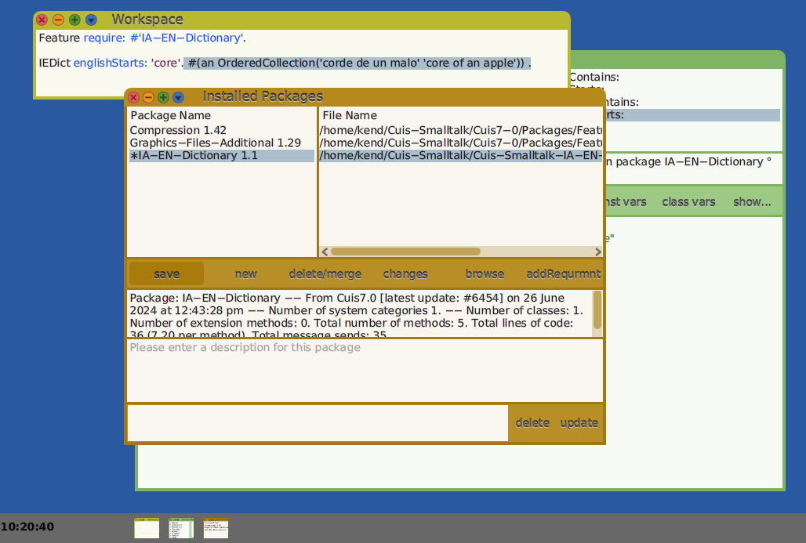

Making a Simple Package for Cuis -- Part 2
================================

This is a continuation of
- https://github.com/Cuis-Smalltalk/Learning-Cuis/blob/master/SamplePackage1.md


### Quick Side Trip -- saving a screenShot.

I mentioned in SamplePackage1.md that I had installed the 'Graphics-FIles-Additional' package.

You can skip to the next section, but here I will explain a bit.

Cuis comes with a ultility to save a screen image.  `Utilities saveScreenshot`.

This will save a screen image with the default name of "CuisWorld.bmp".

I just saved a bitmap image of the screen and its size is about 2 MegaBytes.

Saving the same image as a PNG (Portable Network Graphics) file is 236 KiloBytes in size, so you see why it is worthwhile to load a package to write PNG files.

A useful thing to do at times is to save a Workspace text to a file.
The blue circle at top shows a menu with a "Save As" option.

One can view such a file with a File List, select it, right-click to get the context menu, and select "workspace with contents".  One can now select saved code and Do-It.


In this case the code creates a small invisible field at the top-left of the display which can be clicked on and, after a delay, writes a screen image as a PNG file and increments a counter so that each screenShot gets a different name.

Saving information in Morph's properties allows one to have behavior specialized to an individual Morph.  In this case we don't need to share behavior among Morphs, so subclassing would be overwork.  Did I mention that I was lazy?

Note that a new Smalltalk thread was "forked" to be able to wait while a user action can take place in the main thread.

You don't have to understand or follow this right now, but it is sometimes handy to know how to do such things.

OK, back to the tutorial..


### Package loading

It is good to understand how Cuis finds packages to load.

Cuis looks in "standard places".  What places?  How do we find out?

There is a useful tool that searched for selectors by partial name match.

World Menu --> Open --> Message Names

I typed "findpack" to look for methods which find packages to load.

In this case, there was only one method.

Looking here, I noted 'placesToLookForPackagesDo:' and selected implementors.


First, Cuis looks in the folder the image is running from, then the codePackageFile folder, all children of the Packages directory, the NewPackages directory, and the base directory.

The special directories Cuis uses are described in
https://github.com/Cuis-Smalltalk/Cuis-Smalltalk-Dev/blob/master/Documentation/CuisDirectoryStructure.md

In the code, it is easy select text and Inspect, for example, `DirectoryEntry packagesDirectory` to see what specific directory you are using.

For me, the best thing is for all cloned repositories to be in a common directory named 'Cuis-Smalltalk'.  This way the package code can be searched for in 'Cuis-Smalltalk/Cuis-Smalltalk-Dev' and 'Cuis-Smalltalk/Cuis-Smalltalk-IA-EN-Dictionary'. 


### Feature require: #'IA-EN-Dictionary'

We start with a "fresh" Cuis development image.

World menu -> Open -> Workspace

````Smalltalk
Feature require: #'IA-EN-Dictionary'
````

Note that Cuis does _syntax hilighting_ as you type.  Very useful, this.

- `Feature` is the name of a class
- `require:` is a message selector on the Feature class
- `#'IA-EN-Dictionary'` is a _symbol_

You also have _word completion_.  If you start typing a word, e.g. 'Fea', then type TAB, you get a context based temporary select list of possible completions.

You can ignore these or select one of them and press enter/CR to complete the word you want.


In a Workspace you can select a line of code and either Cmd-click for the context menu and select DoIt or press Cmd-d to compile and run the code.

If the package loads, skip this paragraph and go to the next one. Otherwise, make sure all words are spelled properly and try DoIt again. If there is still a problem, please ask for help on the Cuis mailing list [https://lists.cuis.st/mailman/listinfo/cuis-dev](https://lists.cuis.st/mailman/listinfo/cuis-dev)

After the package has been loaded, you should be able to open a code browser, scroll to and select the category and the IEDict class.  You can also move the mouse to the _class category_ pane of the code browser, Cmd-click to get the context menu, select Find (or just Cmd-f) type 'IEDict' and you should get to the class code.


### Initializing the IEDict Class

In the Class pane, under 'IEDict' there are three buttons labled 'instance', '?', and 'class'.  Click on 'class'.

The difference between Class and Instance is that _instance methods_ operate on individual objects which are instances of a class.  _Class methods_ operate on the class code shared by _all_ instances.  We'll get into what this means in a bit more detail below.

To keep things organized, the class browser groups methods into categories.  We will be adding code which does _class initialization_ so we first add this category.

Cmd-click on the method category pane to get its context menu and add a new method category.


Select the 'class initialization' category to get a _method template_.  


Note the method code syntax hilighting.  The _method selector_ is in black, _comments_ are in green, _temporaries_ are in grey, unknown words in red.


### Reading the Dict Data

The first thing we need to look up words in a dictionary is, of course, the dictionary.  Please open a File List browser and navigate to 'iedict.txt' to see what this text file looks like.  (Cmd-click on World; World->Open->File List).


There is a comment line which indicates the original source of the file, then lines like
- interlingua parolas : english words

Since we want a bidirectional lookup, let's save the data as an array of pairs.

As we only need to read the file once into memory and can share the data, an IEDict class variable is a good home for the data.

Here is one way of doing this.

````Smalltalk
initialize
	"Read in my data"
"
	IEDict initialize.
"
	| curIndex aLine |
	DictData := Array new: 31034. "We know the exact size (wc -l iedict.txt) less 1"

	(self package asFileName asFileEntry parent  // 'iedict.txt') readStreamDo: [ :fileStream |
		fileStream nextLine. "Skip initial comment line"
		curIndex := 1.
		aLine := fileStream nextLine. 
		[aLine isNil] whileFalse: [
			DictData at: curIndex 
				  put: ((aLine findBetweenSubStrs: ':') 
						collect: [:str| str withBlanksTrimmed]). 
			aLine := fileStream nextLine. 
			curIndex := 1 + curIndex.
		]
	] 
````


When I Accept this, I am adding code for the first time since the image started, so the code browser asks who I am.  This is so that my initials get placed into the code's meta-data.  

If you are unknown to the code browser, you may be asked to add your initials.  Please do so!

There is a `versions` button in the code browser which lets you see previous versions of the current method.  You can select a previous version and _revert_ to it if you need to back off a change.

The versions show who is the author of each version.  You know who to ask for help if it is not you!


The text file 'iedict.txt' is read from IEDict's package file name directory.  (Cuis' FileEntry differs from Squeak's DirectoryEntry by the way.  We think it is simpler to use.)

The comment line is skipped and each line is read in as a String which is split on the colon into two substrings which are stored sequentially in an Array which is available in IEDict's DictData class variable.

Now a class' `initialize` method is invoked when a class is filed-in/loaded.  Since we have already created the class IEDict we need to invoke `IEDict>>initialize` ourselves.


### Class initialization

You may have noticed the comment 
````Smalltalk
"
	IEDict initialize.
"
````
One can select any text in a code browser window and DoIt (Cmd-d).  When I am changing method code and may want to invoke the method again, I just add the invocation code as a comment so that I can DoIt without having to open a Workspace.

Did I mention that I like to make things easy for myself?


We DoIt and..


Oops!

Well, I guess we are not perfect.  (You already knew that? ;^)

Let's look at the stack with the debugger to see where we went wrong.


Ah. What happened is this.  Instead of cut+paste, I typed in the code.  When I did this, I typed `asFileName` rather than `fullFileName`.

Fortunately, this is Smalltalk so is easy to fix.

I just 
- edit the code in place
- save (Accept) it
- click the Restart button to back up the computation to the start of this stack frame (the start of this method)
- click the Proceed button to continue from here

We fix things and continue without unwinding the stack!  8^)


Well, without a visible change it is hard to see that `IEDict>>initialize` succeeded.  I could open an object explorer on the IEDict class object, but since we need lookup methods in any case, why not just write them and use them to be sure we read in the dictionary?

Did I mention I was lazy?


### Lookup

We create a `lookup` method category in the IEDict class and add four methods.

For lookup we use the `String>>match:` method.  This does "regular expression"  matching.

These methods look alike with minor variations and are easy.  Did I mention that I like easy?

````Smalltalk
interlinguaContains: aString
	"Answer all definition pairs which contain aString looking in the Interlingua side"

	| matchStr |
	matchStr :=  ('*' , aString , '*' ) .
	
	^DictData select: [ :pairArray | matchStr match: (pairArray at: 1) ]


interlinguaStarts: aString
	"Answer all definition pairs which starts with aString looking in the Interlingua side"

	| matchStr |
	matchStr :=  aString , '*'  .
	
	^DictData select: [ :pairArray | matchStr match: (pairArray at: 1) ]


englishContains: aString
	"Answer all definition pairs which contain aString looking in the English side"

	| matchStr |
	matchStr :=  ('*' , aString , '*' ) .
	
	^DictData select: [ :pairArray | matchStr match: (pairArray at: 2) ]


englishStarts: aString
	"Answer all definition pairs which starts with aString looking in the English side"

	| matchStr |
	matchStr :=  aString , '*'  .
	
	^DictData select: [ :pairArray | matchStr match: (pairArray at: 2) ]
````


### Quicklook Testing in a Workspace

````Smalltalk
IEDict englishStarts: 'core'.
````
Cmd-p (print) will show the result in a Workspace.


You can make up tests for the other methods yourself.

Hey, you can't make me do all the work.  Did I tell you I was lazy?


### Wash, rinse, repeat

Now is a good time to save our work.  (The power goes out here in winter in high winds, so I save my work frequently).

We need to 
- Save the Package
- "git commit"
- "git push"

You remember how to open the package browser and "save", right?



Here is the last time I will bore you with a non-Smalltalk screen shot


### IEDictWindow

OK.  Now to make a window to show our stuff.

How do we do this?

Well, there is a lot of good code in SystemWindow that we can reuse just by subclassing.  (Did I tell you I was lazy?)


An `IEDictWindow` needs to keep track of two things: the text query and the result.

These will be Morphs, graphical screen objects.


One has to Accept (save) the definition in the Class Definition pane before adding text to the Class Comment.

As the _SystemWindow_ class exists one can type 'Sys', hit the TAB key, and select 'SystemWindow' from the popup select-list.


### Opening a IEDictWindow (a new instance)

We want to open a new IEDictWindow by asking its class to make one.

The first step is to add a method category to the class side


Now we add the code to create an instance


`IEDictWindow class>>open` uses the inherited method `SystemWindow class>>open:label:`

Let's take a brief look at this.  Select the text which contains `open:*label:` and Cmd-m (iMplementors).


The `SystemWindow class>>open:label:` method sets the window's _model_, invokes `buildMorphicWindow`, sets the label (if any), and returns the window.

So our next task is to go to the _instance_ side of the class and implement `IEDictWindow>>buildMorphicWindow`.


..which we will do in Part 3 of this tutorial
- https://github.com/Cuis-Smalltalk/Learning-Cuis/blob/master/SamplePackage3.md
