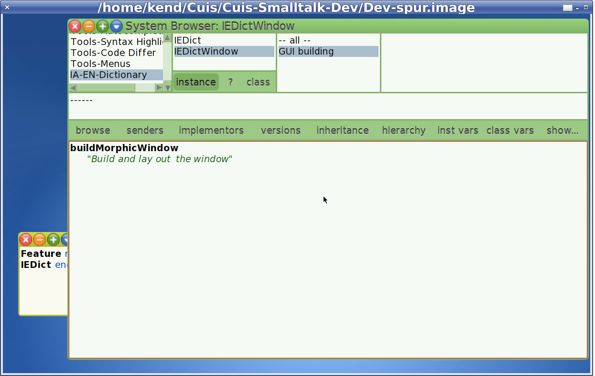
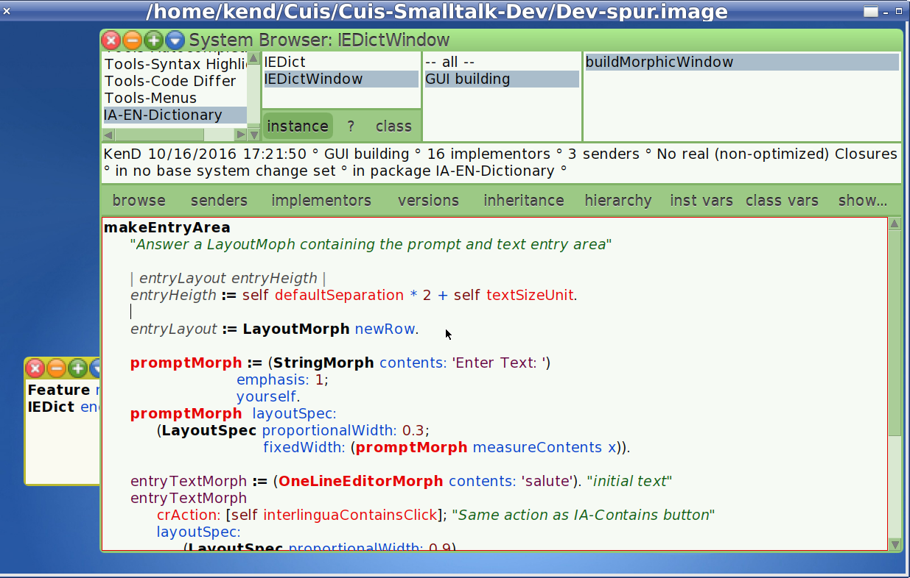

Making a Simple Package for Cuis -- Part 3
================================

This is a continuation of
- https://github.com/Cuis-Smalltalk-Learning/Learning-Cuis/blob/master/SamplePackage2.md

### Context

To review: 
- We are about to put together a SystemWindow.
- To do this we are writing the method IEDictWindow>>buildMorphicWindow
- The Window should look something like


We will use Layouts as described in the Layout Tutorial
- https://github.com/Cuis-Smalltalk-Learning/Learning-Cuis/blob/master/LayoutTour.md

Looking at the desired result, I see a column of
- Prompt and Text Entry
- Buttons
- List of Results

So let's write this down.



Note that when I Accept this method, I get repeated warnings about undefined methods and options to change the text to known methods.

I just select the top line of the menu (the original test) to confirm that this is the choice I want.

OK.  Let's define all those methods.

I'll start with the most complex one: `makeEntryArea`

The LayoutMorph returned is a row with the prompt ('Enter text: ') and a OneLineEditorMorph where the user can type words to be matched.

````Smalltalk
makeEntryArea
	"Answer a LayoutMoph containing the prompt and text entry area"
	
	| entryLayout entryHeigth |
	entryHeigth := self defaultSeparation * 2 + self textSizeUnit.
	
	entryLayout := LayoutMorph newRow.
	
	promptMorph := (StringMorph contents: 'Enter Text: ') 
					emphasis: 1; 
					yourself.
	promptMorph  layoutSpec: 
		(LayoutSpec 
			proportionalWidth: 0.3; 
		   	fixedWidth: (promptMorph measureContents x)).
			
	entryTextMorph := (OneLineEditorMorph contents: 'salute'). "initial text"
	entryTextMorph 
		crAction: [self interlinguaContainsClick]; "Same action as IA-Contains button"
		layoutSpec: 
			(LayoutSpec proportionalWidth: 0.9).
			
	^ entryLayout 
		separation: self defaultSeparation;
		layoutSpec: (LayoutSpec proportionalWidth: 1 fixedHeight: entryHeigth);
		addMorph: promptMorph;
		addMorph: entryTextMorph;
		padding: #left
		yourself
````

Here is what the text above looks like when pasted in the code editor (just select the buildMorphicWindow text with Cmd-a and replace).



@@@
