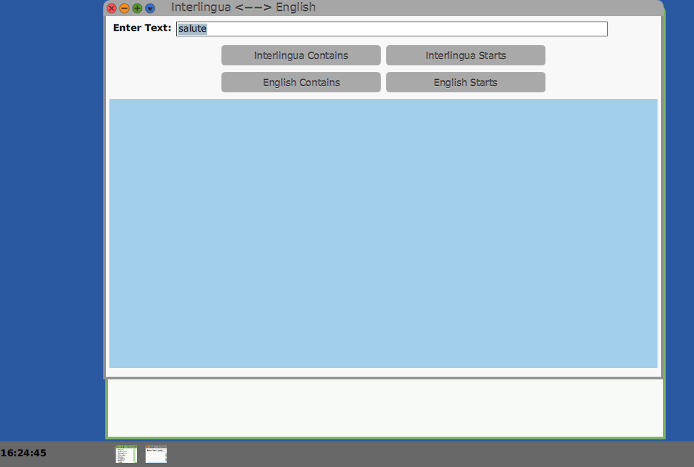
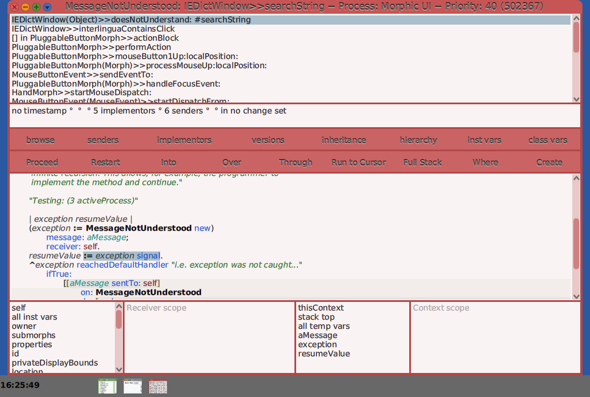

Making a Simple Package for Cuis -- Part 3
================================

This is a continuation of
- https://github.com/Cuis-Smalltalk/Learning-Cuis/blob/master/SamplePackage2.md

### Context

To review: 
- We are about to put together a SystemWindow.
- To do this we are writing the method IEDictWindow>>buildMorphicWindow
- The Window should look something like


We will use Layouts as described in the Layout Tutorial
- https://github.com/Cuis-Smalltalk/Learning-Cuis/blob/master/LayoutTour.md

### buildMorphicWindow

Looking at the desired result, I see a column of
- Prompt and Text Entry
- Buttons
- List of Results

So let's write this down.


Note that when I Accept this method, I get repeated warnings about undefined methods and options to change the text to known methods. 

I just select the unknown selector at the top line of the menu (the original text) to confirm that this is the choice I want.

OK.  Let's define all those methods.

### makeEntryArea

I'll start with the most complex one: `makeEntryArea`

The LayoutMorph returned is a row with the prompt ('Enter text: ') and a TextEntryMorph where the user can type words to be matched.

````Smalltalk
makeEntryArea
	"Answer a LayoutMoph containing the prompt and text entry area"
	
	| entryLayout entryHeigth |
	entryHeigth := self defaultSeparation * 2 + self textSizeUnit.
	
	entryLayout := LayoutMorph newRow.
	
	promptMorph := (LabelMorph contents: 'Enter Text: ') 
				emphasis: AbstractFont boldCode; 
				yourself.
	promptMorph  layoutSpec: 
		(LayoutSpec proportionalWidth: 0.3; 
			    fixedWidth: (promptMorph measureContents x)).
	"initial entry area text"			
	entryTextMorph := (TextEntryMorph contents: 'salute').
	entryTextMorph
		"Same action as IA-Contains button"
		crAction: [self interlinguaContainsClick]; 
		layoutSpec: 
			(LayoutSpec proportionalWidth: 0.9).
			
	^ entryLayout 
		separation: self defaultSeparation;
		layoutSpec: (LayoutSpec proportionalWidth: 1
					fixedHeight: entryHeigth);
		addMorph: promptMorph;
		addMorph: entryTextMorph;
		axisEdgeWeight: #rowLeft
		yourself
````

The height of this LayoutMorph is calculated based on the text size.  One can change the text size via World menu-->Preferences-->Font Sizes.  Don't worry about this for now.  It takes some experimenting to get it right.  More on this later..

We have to set up how the window fields change when resized.  Part of this is by using LayoutSpec's.  We actually measure the size of the promptMorph's string to set this here.

We want the entryTextMorph to extend across the window and so we give it a proportional width of 0.9.  This means to take up 90% of the width of its layout.

We also set the `crAction` for the morph.  This code in invoked when the user types a carriage return / enter key.  As I said above, we want the same action as when a user clicks on the 'Interlingua Contains' button.

We want the prompt string to stick to the left of the layout, so we set the entryLayout's axisEdgeWeight to `#rowLeft`.

We will see how this works when we actually build and return a window.

In the mean time, we need to Accept this code.

Here is what the text above looks like when pasted in the code editor (just select the buildMorphicWindow text with Cmd-a and replace).


Boy, there is a lot of red here!  Not to worry.  The code browser will help us out.

When I Cmd-s (Accept), I find that I have some fixes to make.

I accept undefined `testSizeUnit`, but I forgot to define `promptMorph` as an instance variable.

No worries.  I can select 'declare instance' and the code is added to the class definition for me.  Nice this!

However..


The TextEntryMorph class is missing.

This is a more serious problem.

Time to bail out (cancel) and load the required code!

What has happened is this.  Cuis keeps a small kernel by moving optional code into packages.  This means that the core is smaller and easier to understand.  It also means that we can learn each package Feature incrementally as we need them.

As Cuis gets simpler sometimes code we use and rely on gets moved somewhere else!  That happened to me here.  The TextEntryMorph was moved into a package in the Cuis-Smalltalk-UI directory with a Feature name of `#'UI-Entry'`.

You can do a text search to find such classes.  In a Linux shell this would be `grep TextEntry --files-with-matches */*.st` but each OS has some text search method.  You know which directories to check, right?


After loading the UI-Entry feature, we can Accept the code.  Note that the word `TextEntryMorph` turns from red to black to indicate it is now a known class name.

Also, you can use a FileList to open a Package Browser to view code in a package ***without loading it*** into your image.

This sometimes helps me decide if a package has something I want.


When using something from another package, we say that other package is _required_ for our package to work.  The system does not know this. We need to open an Installed Packages browser and click on the 'add requirement' button.

Note that we only get to select from loaded packages.

The Cuis-Base selection requires a particular version/revision of the base image.  You can delete a previous requirement and select this again to get a new Cuis-Base revision requirement if you need the something provided in the latest Cuis release.

In any case, after adding the `UI-Entry` Feature Requirement, we need to save our package.  

Of course, after we do this it would be a good idea to do a "git commit" "git push" as well!  (not shown)


### makeButtonArea

The next layout we need to make is for the button area.

The buttons should be the same size, so they can share a single LayoutSpec. 

````Smalltalk
makeButtonArea
	"Answer a LayoutMorph with our four buttons -- a column of two rows"
	
	|  buttonHeight buttonLayout interlinguaButtonLayout englishButtonLayout buttonArea |
	buttonHeight := self textSizeUnit * 2.
	buttonLayout := LayoutSpec proportionalWidth: 0.3 fixedHeight: buttonHeight.
	
	interlinguaButtonLayout := LayoutMorph newRow. "a row of two buttons"

	interlinguaButtonLayout 
		axisEdgeWeight: #center; 
		separation: 2;
		addMorph: 
			(PluggableButtonMorph 
				model: self 
				action: #interlinguaContainsClick  
				label: 'Interlingua Contains')  layoutSpec: buttonLayout;
		addMorph: 
			(PluggableButtonMorph 
				model: self 
				action: #interlinguaStartsClick  
				label: 'Interlingua Starts') layoutSpec: buttonLayout.

	englishButtonLayout := LayoutMorph newRow. "a row of two buttons"
									.
	englishButtonLayout 
		axisEdgeWeight: #center; 
		separation: 2;
		addMorph: 
			(PluggableButtonMorph 
				model: self 
				action: #englishContainsClick  
				label: 'English Contains') layoutSpec: buttonLayout;				
		addMorph: 
			(PluggableButtonMorph 
				model: self
				action: #englishStartsClick  
				label: 'English Starts') layoutSpec: buttonLayout.

	buttonArea := LayoutMorph newColumn.
	^ buttonArea 
			layoutSpec: (LayoutSpec proportionalWidth: 1;
						fixedHeight: 4 * self textSizeUnit);
			addMorph: interlinguaButtonLayout ;
			addMorph: englishButtonLayout ;
			yourself
````

This is a somewhat long method which I can break up later if it bothers me.  Right now, the code is simple enough to keep together.

When a PluggableButtonMorph gets clicked on, it invokes the action on its model.  In this case the IEDictWindow wants the event so that it can set the IEDict's searchString before asking for new results.

We'll paste this code in and accept it.


Now, before I forget, is a good time to add event methods for the button actions.


````Smalltalk
interlinguaContainsClick

	self model searchString: self searchString; interlinguaContainsClick


interlinguaStartsClick

	self model searchString: self searchString; interlinguaStartsClick


englishContainsClick

	self model searchString: self searchString; englishContainsClick


englishStartsClick

	self model searchString: self searchString; englishStartsClick
````

Each of these methods just set the model's searchString and tell the model to handle the event.


### makeResultsArea

I need to re-select the 'GUI building' method category and add makeResultsArea.

````Smalltalk
makeResultsArea
	"Answer a LayoutMoph containing the results of the query"
	
	resultMorph := PluggableListMorph
				withModel: model 
				listGetter: #resultAsList
				indexGetter: #resultIndex
				indexSetter: #resultIndex: .
					
	^resultMorph mainView: self
		     menuGetter: nil
		     keystrokeAction: #resultsKey:from: ;
		     layoutSpec: (LayoutSpec proportionalWidth: 1.0
					    proportionalHeight: 0.98);  
		     color: (Theme current textHighlight);
		     yourself
````


The resultMorph is a PluggableListMorph which takes up most of the window real estate.  It asks the model (an IEDict instance) for `resultAsList` and gets and sets an index.

This means that we have to add these three methods to IEDict.  Let's wait a bit on this.

You already pasted and accepted `makeResultsArea` method, right?


### IEDictWindow open

So let's try opening a IEDictWindow!

Many ways to do this.  Since I already typed the text into the IEDictWindow class comment, I go there, select the text and (Cmd-d) DoIt.


Try again, and ..


Ah, need to write `defaultSeparation`.  Thinking back, I also need the `textSizeUnit`.

These kinds of methods typically go in a method class `geometry`


````Smalltalk
defaultSeparation
	"Answer the number of pixels between fields/layouts"
	
	^ 5 "pixels"
````


````Smalltalk
textSizeUnit
	"Answer the scaling factor for sizing; note  method #fontPreferenceChanged"

	^ (Preferences at: #standardListFont) lineSpacing
````

OK.  Try again and...


Ah!  I have to add the access methods to IEDict as well.

I guess it is time to do this now.

Note that I don't have to define everything up front.  It is OK to leave some holes to be filled and just let the system tell me when I try and use them.

### IEDict instance variables

The first thing I need to do is add instance variables so that out IEDict model instance knows and keeps track of its searchString, searchResult, and resultIndex.

I also need to add method class `accessing` and the methods to get and set the values for these.

### method category: `accessing`

````Smalltalk
searchString
	
	^ searchString
````

````Smalltalk
searchString: aRegularExpressionString
	
	searchString := aRegularExpressionString
````

Likewise for searchResult and resultIndex.


### method category: `initialization`

````Smalltalk
initialize

	super initialize.
	searchString := 'salute'.
	searchResult := #().
	resultIndex  := 0.
````

### method category: `ui support`

OK.  Here it gets interesting.

Remember the four methods used by our buttons?

They just make use of the search functions we already defined.

````Smalltalk
interlinguaContainsClick
	
	self searchResult:  (IEDict interlinguaContains: (self searchString)).
	self resultIndex: 0.
````

````Smalltalk
interlinguaStartsClick
	
	self searchResult:  (IEDict interlinguaStarts: (self searchString)).
	self resultIndex: 0.

````

````Smalltalk
englishContainsClick
	
	self searchResult:  (IEDict englishContains: (self searchString)).
	self resultIndex: 0.

````

````Smalltalk
englishStartsClick
	
	self searchResult:  (IEDict englishStarts: (self searchString)).
	self resultIndex: 0.
````

Finally, we need to format our search results from an array of pairs to a string.


````Smalltalk
resultAsList
	"Answer a list of form 'this <---> that' "
	
	^ self searchResult collect:[ :elt | (elt at: 1) , ' <---> ', (elt at: 2) ]
````

### A Window!

Try yet again and...



Yay!!  

Be sure to celebrate each success!

Not bad looking, except for a bit of color.

Let's click on a button and...



Ah.  We need `accessing` methods in IEDictWindow as well.

````Smalltalk
entryTextMorph
	^entryTextMorph

promptMorph
	^ promptMorph

resultMorph
	^ resultMorph
````

And importantly:

````Smalltalk
searchString

	^ entryTextMorph contents asString 
````


Now we can click on the buttons without bringing up the debugger, but something is missing!  The results!


How do we fix this?

We have to go back to the idea of separating a _model_ from a _view_ onto that model.

The basic idea is that these are separated so that one can have multiple views of the same model.  The model, to be separate, should ***not*** have to know anything about views.


So how does a view know when to update its display of the model's information?

The answer to that is ***events***.

When something changes in a model, it just announces an event.  Any view (any object, really) can register as interested in an event.

The model says "something happened, deal with it" without knowing who, if anyone, is listening.


When is there an interesting event?

In the case of IEDict, it is when a search takes place and a new result is obtained.

So IEDict, our model, needs to announce an event when there is a new search result.

````Smalltalk
searchResult: newResult

	searchResult := newResult.
	self triggerEvent: #newSearchResult
````

And how to register that the IEDictWindow has an interest in events?

Let's put this in the buildMorphicWindow method

````Smalltalk
buildMorphicWindow
	"Build and lay out the window and answer it."

	self layoutMorph 
		beColumn;  "the default"
		separation: self defaultSeparation;
		layoutSpec: LayoutSpec useAll;
		addMorph: self makeEntryArea;
		addMorph: self makeButtonArea;
		addMorph: self makeResultsArea.
		
	model when: #newSearchResult send: #searchResultsChanged to: self.
	model interlinguaContainsClick. "set initial text"
	
	^ self
````

Now IEDictWindow needs a `searchResultsChanged` method added to its `events` methods

````Smalltalk
searchResultsChanged
	"Display updated search results"
	
	resultMorph updateList 
````

OK.  Let's click on some buttons!!


Wow!!  The buttons work!!

This could be good!


In part 4 we will look at refinements:
- A bit better color
- Font resize when the font preference changes
- Adding a selection to the Open menu.

On to 
- https://github.com/Cuis-Smalltalk/Learning-Cuis/blob/master/SamplePackage4.md
