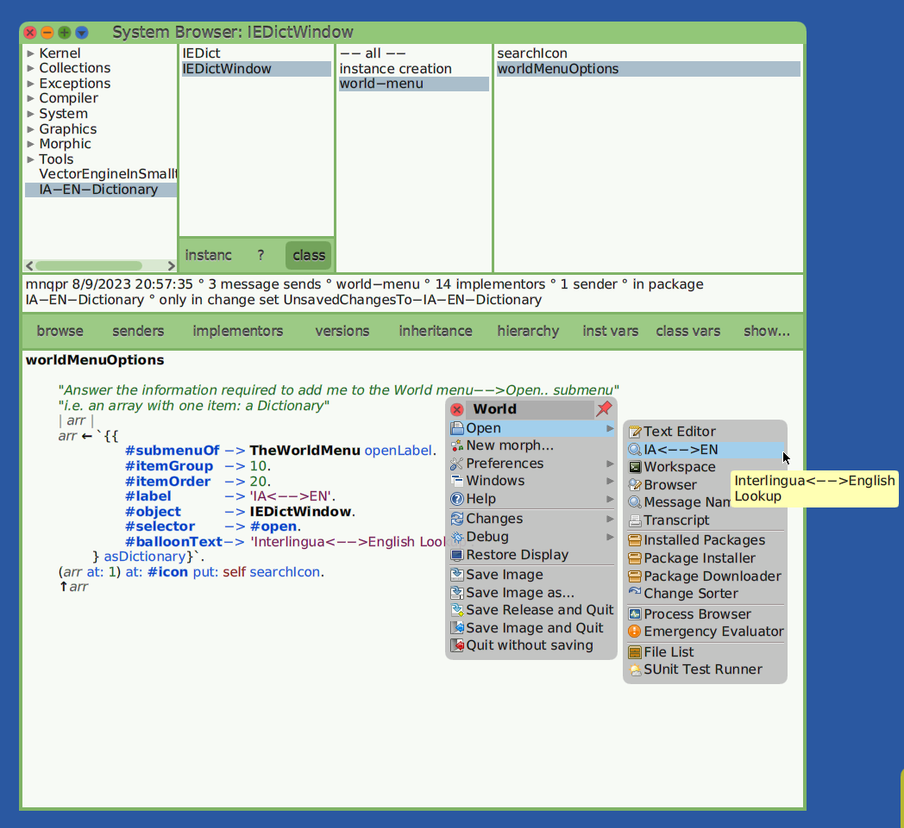
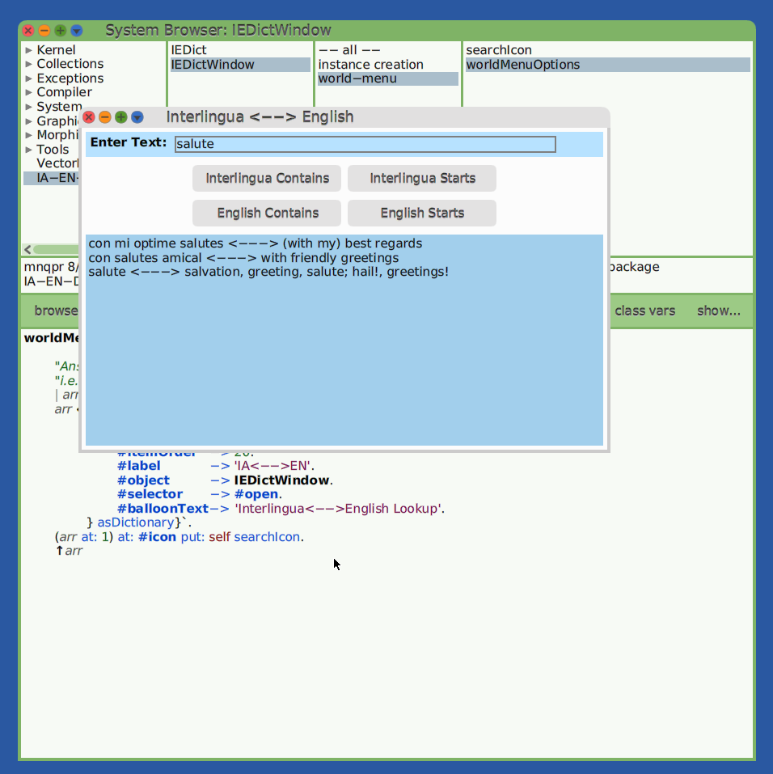

Making a Simple Package for Cuis -- Part 4
================================

This is a continuation of
- https://github.com/Cuis-Smalltalk-Learning/Learning-Cuis/blob/master/SamplePackage3.md

### Add to the World->Open menu

The next thing I am going to do is add a selection to the Open menu to open an IEDictWindow.  

There are several reasons for this.

For one thing, when one has dictionaries or other useful browsers it is good to have them available where they can be found.

Another reason is that I keep opening an IEDictWindow and I want to make this easy.  (Did I tell you I was lazy?  ;^)

Also, adding a menu item is easy.  Just add a method to the class side of your browser class.  In our case, IEDictWindow class.

````Smalltalk
worldMenuForOpenGroup
	"Answer the information required to add me to the World menu-->Open.. submenu"

	^ Dictionary new
		
			at: #itemGroup
			put: 10;
		
			at: #itemOrder
			put: 20;
		
			at: #label
			put: 'IA<-->EN';
		
			at: #object
			put: self;
		
			at: #selector
			put: #open;
		
			at: #balloonText
			put: 'Interlingua<-->English Lookup';
		yourself.
````




Hey, do I like easy!

You can hilight `worldMenuForOpenGroup` and Cmd-n (seNders) or Cmd-m (iMplementors) to see how menus get built.


### A bit of Color

OK. Let's fix the color a bit.  I want a different background color.

I am going to write a method to return the background color so that I can try out a few different colors.

For IEDictWindow I create a method category `color` and add the method

````Smalltalk
backgroundColor

	^  Theme current transcript muchLighter
````

Then I set the window's background color in the instance side in method buildMorphicWindow.

````Smalltalk
buildMorphicWindow
	"Build and lay out the window and answer it."

	self layoutMorph 
		beColumn;  "the default"
		separation: self defaultSeparation;
		layoutSpec: LayoutSpec useAll;
		addMorph: self makeEntryArea;
		addMorph: self makeButtonArea;
		addMorph: self makeResultsArea.
		
	model when: #newSearchResult send: #searchResultsChanged to: self.
	model interlinguaContainsClick. "set initial text"
	
	self color: self backgroundColor.
	
	^ self
````

Now to open an new window from the Open menu and ...


Nothing happened?  Huh?

This just goes to show that we need to flexible and numble enough to deal with the unexpected.

Let's look around a bit.

I Cmd-click on the IEDictWindow morph and use its _menu handle_ to open an Inspector on it.

In the Workspace pane of the Inspector I type
````Smalltalk
self color: self backgroundColor.
````
Press Cmd-d (DoIt) and ...


The background color for the window is set as I expect.

So the color setting changed _after_ it was set in `buildMorphicWindow`.

Who is clobbering our color setting?

How do we solve this mystery? 

Let's see who is messaging/calling `buildMorphicWindow`.

Being lazy (did I tell you I was lazy?), I go back to the buildMorphicWindow method, select the name and Cmd-n (seNders of it).


I find that the `SystemWindow class>>open:label:` method
- creates a new window
- sets its model
- invokes `buildMorphicWindow`
- sets the window's label in the title bar
- opens it in the current world

Nothing wierd here.  

Let's look at implementors of `openInWorld`


Ah hah!  

SystemWindow's `openInWorld` is overriding Morph's `openInWorld` to fiddle with window colors.

We can override `SystemWindow>>windowColor` with our own color method
````Smalltalk
windowColor
	"Use current theme"
	
	^Theme current transcript 
````

Note: you can hilight `Theme`, Cmd-b (Browse the class) to look at various color selections.  Exploring a Color shows a small color swatch.  For Color details, look at various sets of named colors and the Color Editor.
- https://github.com/KenDickey/Cuis-Smalltalk-NamedColors
- https://github.com/KenDickey/Cuis-Smalltalk-ColorEditor


Trying this out...


This is starting to look pretty good.

Now, rather than change the `SystemWindow>>openInWorld` method, I am going to set some color values ***after*** `openInWorld` rather than before.

We can do this in `IEDictWindow class>>open`
````Smalltalk
open
"
	IEDictWindow open.
"
	| newSelf |
	newSelf := self open: (IEDict new) label: 'Interlingua <--> English'.
	"Override default color resets in SystemWindow>>openInWorld"
	newSelf color: newSelf backgroundColor.
	newSelf layoutMorph submorphs last "the text entry layout morph"
		color: (Theme current textHighlight lighter).
	^ newSelf
````

Open an new IEDictWindow and...


Super!!

Now we know we can play with colors to get whatever we want want.


### Font Resize

World menu->Preferences->Font Sizes lets one select a font size which works well with one's screen size and resolution -- or to set large for a demo or talk.

If you play with these for a bit, you will see that most windows do pretty much the right thing.

We want our window to do the right thing as well.

This means that our basic window size should be scaled based on the current font.

One way to do this is by changing the window size so that it looks right and asking it for it's unscaled size.


I did that here by DoIt (Cmd-d) on an Inspector opened on the IEDictWindow where I asked the question
````Smalltalk
(self morphExtent / self textSizeUnit) rounded.
````

Now I can add a method to the `geometry` category
````Smalltalk
initialExtent

	^ (30 @ 16) * self textSizeUnit 
````

When we select a font size and open an IEDictWindow, it scales itself to the font we use.


However, if we change the font now the window does not look so good.


To fix this, we need to look at how fonts are updated when the font preference changes.

In this case, I bring up a Message Names browser.  (World menu->Open->Message Names) and type 'fontpref', hit return, and look at the SystemWindow method that deals with this.


I also look at some of the other fontPreferenceChanged methods to see how they handle this method.

Basically, Morphs which draw Strings know how to update their fonts.  However, window Morphs do their own layouts and only the windows know how to update this when things change.

So we can adjust in our own fontPreferenceChanged method.

````Smalltalk
fontPreferenceChanged

  super fontPreferenceChanged.
  self promptMorph 
		layoutSpec: (LayoutSpec 
						proportionalWidth: 0.3; 
						fixedWidth: 
							(self promptMorph measureContents x)).
  self layoutMorph submorphs last "text entry layout"
	layoutSpec: (LayoutSpec
					proportionalWidth: 1 
					fixedHeight: self defaultSeparation * 2 + self textSizeUnit).
					
	self morphExtent: (self morphExtent max: self initialExtent).
````

Let's try again.  Set the font preference to Small, open an IEDictWindow, set to Huge.


Ah!  Much better!  Celebrate success!

I did not update the button layouts when the font preference changed.  Feel free to do so.  (Did I tell you I was lazy?) 

### Add documentation method whyMe

I sometimes add a documentation method with the name `whyMe` to an important class which returns a string.

Interlingua is a bit odd, so I add one here to the IEDict class.

```` Smalltalk
whyMe
	"Answer what you always wanted to know..."

	^'Interlingua is an auxiliary language made from common elements of the romance languages and English. The language has been in use since the 1950''s and is very readable.

You can find out much more at http://www.interlingua.com
	
The dictionary presented here is based on a 30,000 entry dictionary available from Paul Denisowski (paul@denisowski.org)  at  
	http://www.denisowski.org/Interlingua/Interlingua.html

Interlingua Sample:
	
Pro personas qui es familiar con le vocabulario panoccidental Interlingua es comprensibile a prime vista. Per un texto in Interlingua on pote attinger un grande publico multinational cultivate. Pro altere personas Interlingua offere un utile introduction al tresor de vocabulos scientific, technic e cultural. Illo anque facilita le lectura de linguas romanic. Interlingua pote esser un profitabile factor supplementari in studios linguistic. Le internationalitate del vocabulario e le simplicitate del grammatica possibilisa al lector o studiante tosto occupar le position de un active usator de Interlingua.
...
Lingua natural
e musical
de parolas international
e un grammatica phenomenal!

Comprehensibile facilemente
in le mundo per tote le gente:
apprender lo es un acto intelligente!

Le medio de comprehension
pro le solution del confusion
in le global communication!
'
````


### Check Our Work

OK.  Time to save our package, "git commit", "git push".

Open a new image.

`Feature require: #''`

And check our work.

Did we remember to _require_ all packages we depend on?

Ben obra!!

